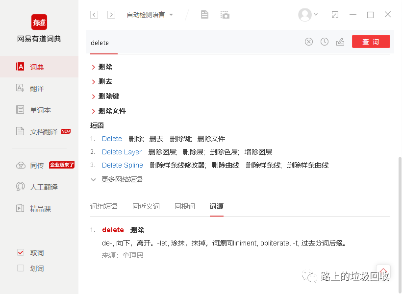

[目录](./)
# 聊聊 Remove 和 Delete 的那些事儿

不知怎的，突然想到了remove 和 delete 有啥区别？这个话题。
于是，上网搜索了一下，发现在看起来像是纽约政府的一个什么网站上找到了答案。

> Remove and Delete are defined quite similarly, but the main difference between them is that delete means erase (i.e. rendered nonexistent or nonrecoverable), while remove denotes take away and set aside (but kept in existence).
> 
> 来源：[https://apps.labor.ny.gov/ux/doc/v1/design-remove-vs-delete.html](https://apps.labor.ny.gov/ux/doc/v1/design-remove-vs-delete.html)

翻译一下就是

> Remove 和 Delete 的定义非常相近，但最主要的区别在于 delete 是 擦除（使之不存在或者不可恢复），而 remove 表示拿走或者放在一边（但依然存在）

这就解释的挺明白的了，delete 是从根上抹消某个东西，物理删除。而 remove 则是让其无效化，或者说从逻辑上删除。
一个不太恰当的例子，delete 就是杀人灭口，人直接死了；remove就像是社会性杀人，人虽然还或者，但却社会性死亡率，也就是无法在这个世上立足，等于这个人死了。

如果再进一步，从词根上来看这两个词。delete 从 de-，从 -let ，两个都是抹消的意思；而 remove 从 re- ，从 mov- ，也就是一移再移的意思，移除是引申出来的。

