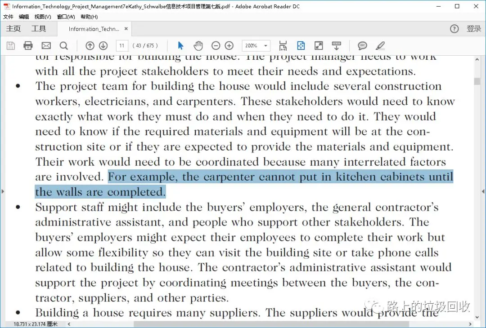

[目录](./)

# [英语]一个单词的错误理解造成的血案

看书的时候，看到一句话。

> For example, the carpenter cannot put in kitchen cabinets until the walls are completed.

然后一翻译，顿时鬼畜……

> 比如，木匠在墙完工前是不会放到橱柜中去的。

额……

细想来，这句话应该是才对。

> 比如，木匠在墙完工前是不会把橱柜放到厨房里去的。

但问题来了：

> 前者虽然主谓宾都对，但怎么看怎么不对
> 
> 后者虽然翻译应该是对的，但真是原文要表表达的意思？

纠结。

然后去问了一个英语大咖，说要上下文，于是就把原文给贴了上来：

然后一会儿回我说：

> 那个 put in 这里不是做放置解，而应该翻译成花费。  
> 所以这么一来，整句话的意思就变成了：  
> 木匠在墙完工前是不会为厨房里的东西花钱的。

如此一来，恍然大悟！原来自己总感觉到不对劲，却说不出来的地方是在那个put in上面。是没想到一个单词的错误理解如此鬼畜……

又学了一招！