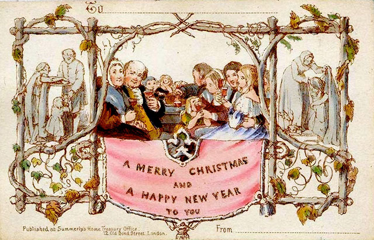

[目录](./)
# 第一张圣诞卡

## 译文

现在，每年的圣诞节我们都会寄出成千上万张圣诞卡。但事实上圣诞卡是最近才被发明的东西。

在中世纪，欧洲木雕师经常使用宗教题材来进行创作。但事实上第一张真正意义上的圣诞卡，是在1840年的英国伦敦被设计出来，并一直卖到1843年。设计师是 John Callcott Horsley ，一个知名的英国画家以及皇家学会成员。他在他的朋友 Henry Cole 先生的建议下设计出了圣诞卡。Henry Cole 先生是 Victoria & Albert 博物馆的第一任馆长。Horsley 制作了 1000 张贺卡，并以每张 1 先令的价格出售。这些圣诞卡被印刷在硬卡纸上，并且手工上色，还书写有“祝你圣诞快乐然后祝你新年快乐”的问候语。卡片被设计为三个区域：中间是一个家庭；一侧是给穷人分发食物；另一侧是给穷人分发衣服。清教徒们马上就谴责了这张卡，因为卡片中的场景是人们在家庭聚会中喝酒。但对大多数人来说，这个点子非常成功，然后圣诞卡就迅速地流行开来了。

圣诞卡不是最早的贺卡，在 1796 年，随着印刷术的改进，商家就开始给他们的客户在新年寄去卡片，表达”祝贺“。在很多国家，圣诞卡正在变得比新年贺卡更流行。

圣诞节作为耶稣的生日，圣诞卡也就会经常描绘关于他的诞生。其他则通过覆盖着厚厚积雪的松树的寒冬、圣诞老人、星星、蜡烛、冬青树等来描绘圣诞节。一般写在圣诞卡上的问候语是：” Merry Chrismas “，但也有人把问候语写成”Happy Xmas“、”Happy Noel“。

## 原文

[The First Christmas Card](https://www.englishclub.com/esl-articles/200112.php)