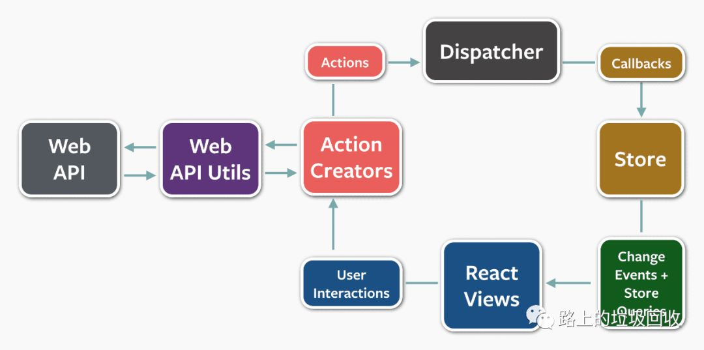

[目录](./)
# 【英翻】Flux：动作（Actions）和分发器（Dispatcher）

## 前言
因为我自己对 Flux 也在学习中，所以很多东西的翻译可能并不到位，更多是每个单词直接翻译过来，很可能词不达意。翻译自己不熟悉的领域，果然不是什么轻松的活。如果以后有机会，等对 Flux 有所了解了之后，再回来重新校对一遍此文吧。

反正你们都忍我这么久了，也不差这一次是吧。┐(¯v¯)┌

## 译文

Flux <a href="#f0">注0</a> 是 Facebook 用于构建 JavaScript程序 的一种软件架构。它的基础是单向数据流（unidirectional data flow）。我们通过 Flux 构建了从小工具到大程序的各种东西。它能处理所有我们交给它的任务。因为我们发现它是构建代码的好办法，所以我们非常激动地将其贡献给了开源社区。Jing Chen 在 [F8 大会]<a href="#f1">注1</a> 提出了 Flux，从那之后我们看见了很多关于 Flux 的介绍。我们也同样公开了一个[附带教程](https://facebook.github.io/flux/docs/todo-list.html) 的 [Flux概述（Overview of Flux）](https://facebook.github.io/flux/docs/overview.html) 和一个 [TodoMVC 示例](https://github.com/facebook/flux/tree/master/examples/flux-todomvc/)

Flux 与其说是一种成熟的框架，不如说是一种模式，甚至可以完全不用去管 React 中的大量新代码去开始使用它。虽然直到最近我们都没有还没有发布 Flux软件 中最重要的部分：分发器。但随着新的 [Flux代码仓库](https://github.com/facebook/flux](https://github.com/facebook/flux) 和 [Flux官网](https://facebook.github.io/flux/](https://facebook.github.io/flux/) 的建立，我们终于开源了在我们自己的项目中用到的同款[分发器](https://facebook.github.io/flux/docs/dispatcher.html](https://facebook.github.io/flux/docs/dispatcher.html)。

### 分发器在 Flux数据 中处于什么位置

分发器是一个单例（singleton），在 Flux 程序的中心位置控制数据的流向。它本质上是一系列已注册的回调（registry of callbacks），可以按需求调用这些回调。每个 store 都都会像分发器注册一个回调。当有新的数据进入分发器后，分发器会通过这些回调将数据项各个 store 传播。回调是通过 dispath() 方法来调用的，这个方法将数据当作唯一的参数传递给目标对象。

### 工作和动作创建器（ActionCreators）

当心数据进入系统后，无论是人机交互还是 WEB API 的调用，数据都会被打包为一个动作——一个包含了全新的据新字段和特定的动作类型的对象字面量（object literal）。我们通常会会建立一个称为的动作创建器辅助方法库。这个库不仅仅创建动作对象，也将数据转传递分发器。

不同的动作间通过类型属性（type attribute）来标识。当所有保存着的 store 接收到动作时它们会通过这个属性来决定是否相应以及如何响应。在一个 Flux 程序中，store 和 view 都控制着它们自己，保证不会被外部对象所操作。[动作通过它们定义和注册进入 store ，而不用经过 stter 方法<a href="#f2">注2</a>。

让 store 自我更新，可以减少很多 MVC程序 中典型的错误纠缠（entanglements）。在模型间发生级联更新时会导致状态不稳定并很难进行造成精确的测试。数据通过 Flux程序来高度解耦，并且严格遵守[墨忒耳定律](https://en.wikipedia.org/wiki/Law_of_Demeter](https://en.wikipedia.org/wiki/Law_of_Demeter)：即一个系统中的所有对象应该尽少于该系统中的其他对象产生联系。而结果就是软件变得更可容易维护、更容易升级、等容易测试，还有更容易让新来的工程师无了解这个系统。

### 我们为什么需要分发器

随着应用程序的发展，store 之间一定会形成关联依赖。当需要更新 store A 的时候，必须先更新 store B 后，store A 才会去更新它自己。我们需要分发器去调用 store B 的回调，并在 store A 结束前结束回调。在使用前需要断言式的声明（declaratively assert）这个依赖，store 对分发器说：“我要等待到 Store B 完成这个动作”。分发器通过 waitFor() 方法来实现该功能。

dispath() 方法通过一个简单的同步迭代来串联回调，并按顺序调用。当在回调时遇到 waitFor() 时就暂停回调，并由 waitFor() 提供了新的依赖迭代周期（teration cycle）供我们使用。在整个依赖集合加载完毕后，最原始的回调就会继续执行。

而且，waitFor 方法可以同一个 store 的回中会通过不同的途径来调用不同的动作。在一次过程中，store A 会需要等待 store B 。但在其他过程中，store A 等待的对象或许就变成了 store C 。在特定的代码中使用 waitFor() 可以让我们对一个动作的依赖进行精密控制。

可是一旦我们有了循环依赖，就出问题了。那是因为 store A 需要等待 store B ，而 store B 又要等待 store A ，然后就会陷入死循环中。分发器会从 Flux 中得到一个返回信息，并将错误信息向上抛出提示开发者程序出现了问题。开发者可以创建一个全新 store 已解决这个循环依赖的问题。

### 聊天软件的例子

与 Facebook 在其他项目中用的分发器一样，我们也开源了一个新的[聊天软件](https://github.com/facebook/flux/tree/master/examples/flux-chat) 例子。比最简单的 TodoMVC 稍微复杂了一些，所以工程师们可以更好的理解 Flux 是怎么解决 store 和 依赖之间的关系的，以及如何在 Web API 上应用。

我们希望新的 Flux 库 可以随着时间的增长功能越来越强大，被别人的代码采用以及其他。然后我们也希望 Flux 会像我们认为的那样对你有所用处。加油！

## 译注

* <a href="#a0">注0</a> flux 的意思是流动、流向、通量的意思，因为属于技术用于，所以保持英语原文。
* <a href="#a1">注1</a> 原链接是一个 youtube 视频，已将该视频上传 QQ 视频：[https://v.qq.com/x/page/f3053mm66mc.html](https://v.qq.com/x/page/f3053mm66mc.html)。
* <a href="#a2">注2</a> 这段文中的好几个 they 的指代有些不清不楚，看得我有点糊里糊涂，暂时这么翻译，以后再慢慢改。

## 原文

[https://reactjs.org/blog/2014/07/30/flux-actions-and-the-dispatcher.html](https://reactjs.org/blog/2014/07/30/flux-actions-and-the-dispatcher.html)