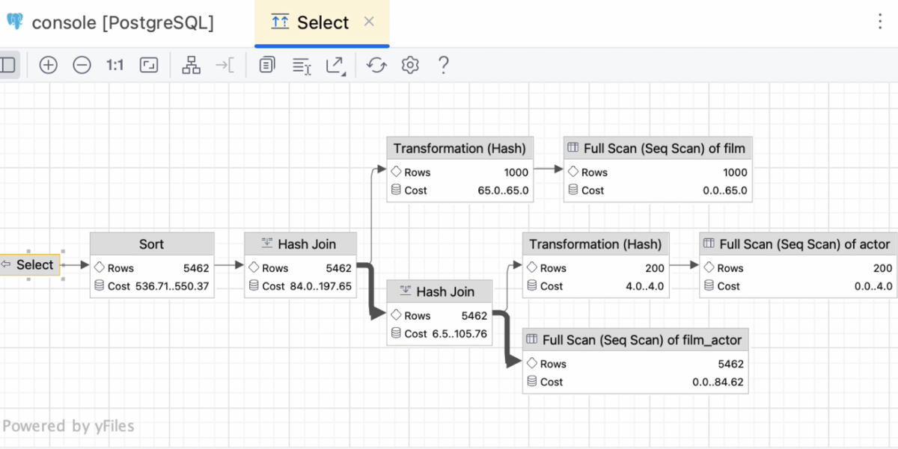
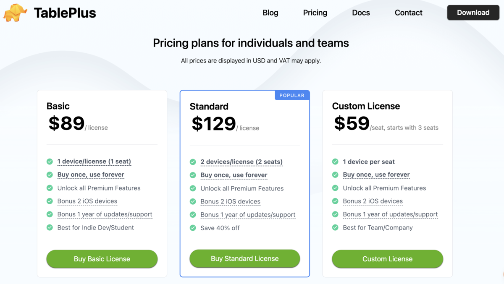
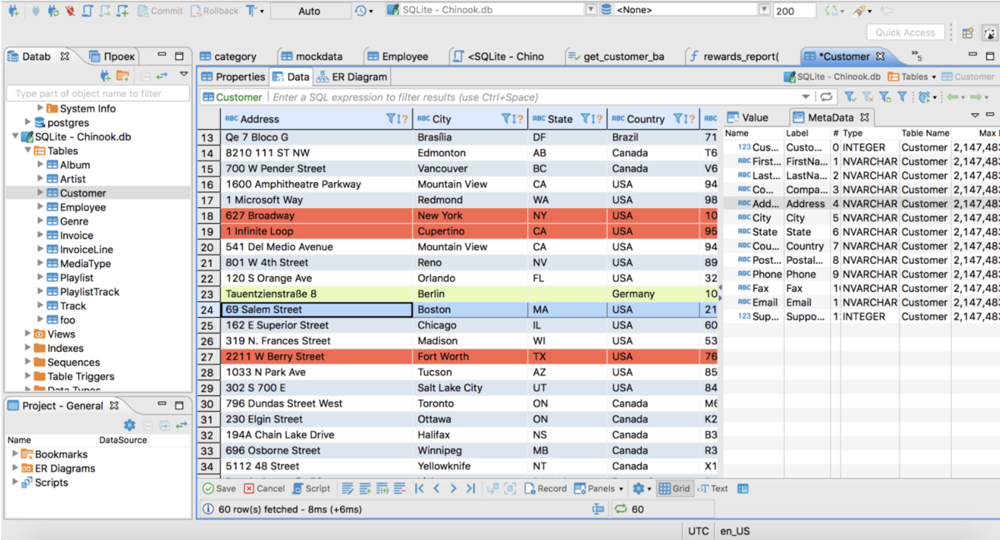
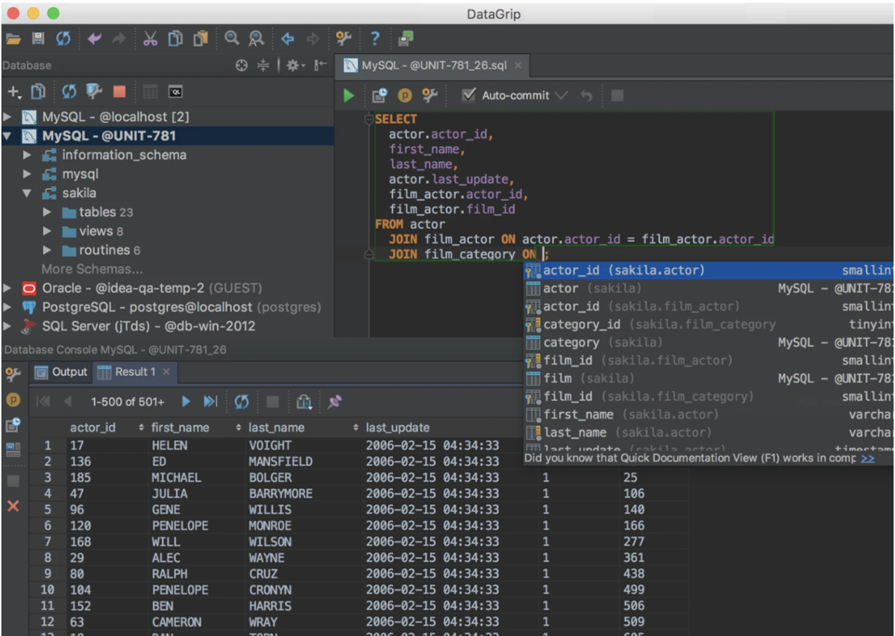
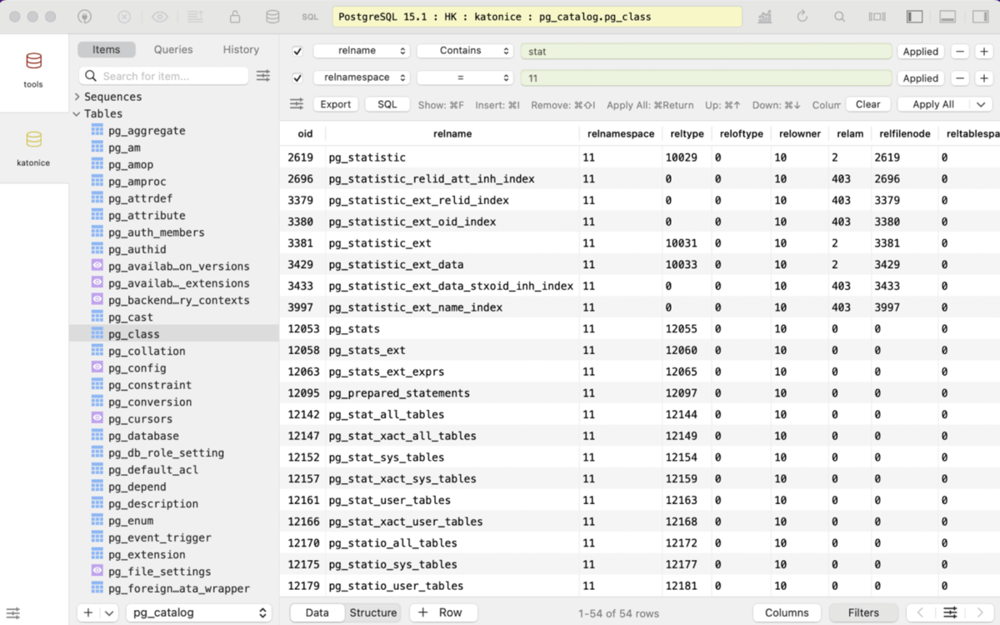

[目录](./)

> 译者序
> 我最早使用 DBeaver 是十多年前的事情了。
> 使用它的原因也很有意思，因为当时痴迷于 Linux + SQLite，所以我找了一圈，在 Deepin 下可以正常显示 SQLite 里 big int 数据类型的，只有 DBeaver，其他要么 是 Windows 专用，要么就是显示出一个负数，包括某些声称给 SQLite 开发的客户端。
> 
> 而那些年中，经历过公司因为版权问题不得不停用 Navicat，我自岿然不动向天笑。  
> 但是公司IT部门推荐 DBeaver 的时候，我当着全公司（也就不到100人）装B的感觉确实很不错~
> 
> 然后，就没有然后了。  
> 这一用就是十多年，然后就是最近看到了这篇文章。

#开始

大家好，我是 Pext Job开发组的栃川。

最近在开发组内部，展开了对于“最强的DB客户端是哪个”这个话题的讨论。

我虽然强烈推荐一个名为“DBevaer”的工具，但其他同事却不这么认为。那就让我来科普并介绍一下 DBevaer 吧。

#公司内部使用的 DB客户端工具

在介绍 DBeaver 的优点之前，先解说一下公司内部正在使用的工具。

向开发组的同事打听了一下都正在使用什么工具，主要分为下面这两类。

* DataGrip
  收费软件，一款支持关系型数据库和 NoSQL 数据库的强大跨平台工具。
   
* TablGrip
  免费软件，简洁而现代的 SQL 客户端工具。

来听听使用上面两种工具的同事们都说了些这两个软件的哪些优点吧。

##使用 DataGrip 同事的声音

DataGrip 因为是收费软件，果然很多同事都提到了它出色的功能性。还有一眼就明白的漂亮 UI 也似乎是被推荐的原因之一。

> 总是就是无法抛弃它的漂亮UI，主题可以切换也是值得一说的点
> ——小T

> 过活用 AI 机能 ，可以毫不费力的写 query，真是非常得我心
> ——小S

> 能将查询计划（Query Plan）和 EXPLAIN 结果以帧图（Frame Graph）的形式可视化地表现出来，这一点深得我心。
> ——小I
> 译者注：译者没用过 DataGrip，所以不太保证将 Frame Graph 翻译为帧图是否准确。

##使用 TablePlus 同事的声音

即便作为免费软件，TablePlus 也有着不输于 DataGrip 那样地功能性和 UI ，这方面的评价声音最大。”。

> 作为免费软件，UI已经够好了
> ——小Y

> 它具备的功能足以应对各种日常业务，这点让人很安心。
> ——小Y

> 因为它既有免费版也有收费版，可以按需逐步升级，这一点非常好。
> ——小K

#布道失败，DBeaver 并没有被接受的原因是因为

事实上，我也曾经向同事们宣传过 DBeaver 。

我曾经会对刚进公司的新同事们说一句：“DBeaver 很不错哦”。但最后他们还是选择了 DataGrip 或者 TablePlus 。

同事们对 DBeaver 最无法接受的理由是“很不习惯那种UI”。

就 DBeaver 这种把多个功能入口全部塞到一个画面里的配置来说，对初次使用来说确实可能会比较难以习惯。

手机上，我自己再最开始使用的时候也苦战了一番。方式对这种设计也挺反感的（笑）。

> 译者吐槽：不明白这种 UI 哪里让人反感了，自己用着非常顺手啊

这点 DataGrip 和 TablePlus 的画面构成就非常精简且符合直觉，操作起来很方便。也可以理解有那么多同事都选择了它们。

  

#即便如此我还是使用 DBevaer

粗略看下来，DBeaver 的UI不并不容易上手，反而看起来因为各种功能的堆砌太多导致很难上手。

即便如此，我还是继续使用 DBeaver ，因为我觉得它有下面四个不得不说的有点。

##活跃的社区氛围

DBeaver 的开发非常活跃，社区的也非常的火热，这一点非常突出。

新功能和改善会马上得到落实，工具也在日益变得更易用。就算发生了问题，bug 也很快就会被修复，让人能继续安心地使用。

更何况社区非常活跃，**基本不用担心开发突然停止**，是可以长期使用的工具。

最近的开发状况可以通过 Github 来确认，有兴趣的一定要看一看。

##包容一切机能的多样性

DBeaver 并不只是一个单纯的 SQL 客户端工具，它最大的魅力所在是它丰富的功能。

可以使用的数据库类型非常多，不仅仅是主流的关系型数据库，NoSQL数据库、云数据库也都可以应对。因为一个工具可以连接各种各样的数据库，就不再需要为每个数据库单独配置客户端工具了。

以及从通过 GUI 进行的直观操作，SQL 编辑器可以写非常难的 查询语句、做成ER 图、数据的导入导出、甚至可以执行任务计划和使用自定义插件，它能满足开发者广泛需求的各种功能。

因为如此，就算技术栈发生了变化，对开发者来说，也不需要每次都要再去找平替工具了。因为这种兼容性，**DBeaver 是可以长期信任的伙伴**。

##因为丰富的信息所带来的安心感

DBeaver 最大的优点在于有着**丰富的信息**。

就像我在最开始的时候说的那样，把 DBeaver 玩的很好的人应该也是不很多。

但同时，使用 DBeaver 的人也很多。用 Google 搜一下，就能轻松找到各种详细教程。再加上官网的文档写的非常优秀，不会让人看得一头雾水。能让你搞懂怎么操作和设置。

刚开始用 DBeaver 的时候确实可能会觉得不太习惯。但因为丰富的信息会让初学者非常容易地使用。对老手来说，更是可以根根**据自己的喜好来配置**。

##最强的性价比

DBeaver 最大的魅力就是基本可以**免费使用**这点。

就开发者而言，怎么选工具是直接关系到生产性的重要决定。

确实，为了提高开发生产性的投资是有价值的，还能享受因为开发生产性而带来的巨大利益。

但是，能不花钱最好还是不花钱。

特别是对经费有限的项目或者创业公司来说，控制工具的成本具有非常大的意义。

DBeaver 正因为这种期待而诞生。不仅免费，还被赞誉为有高度可信赖的丰富功能的工具。不用管预算，直接上手就行。那省下来的成本花到其他重要的投资里去。

DBeaver通过提供【高品质×免费】，不正是开发者最理想中的选项嘛。

#题外话：DBevaer的读法

关于“DBevaer”怎么读，我一直以按“D-B-eaver”（译者注：/di:-bi:-ˈiːvər/）来读。但正确的读法却应该是“D-beaver”（译者注：/di:-ˈbi:vər/）。

我一直不明白为什么官网上会用海狸（beaver）当吉祥物，原来是因为名字的关系啊。

#总结

DBevaer 的优点已经随性写到了这里。

当然，其他的工具也有自己的优点，而且也知道对 DBeaver 的各种争论。

即便如此，我也会因为多样的功能和免费使用的便利性，还有那个日益强大的社区，从而而继续使用 DBevaer 。

#写在最后

【略】

# 原文

[https://product.plex.co.jp/entry/dbeaver](https://product.plex.co.jp/entry/dbeaver)