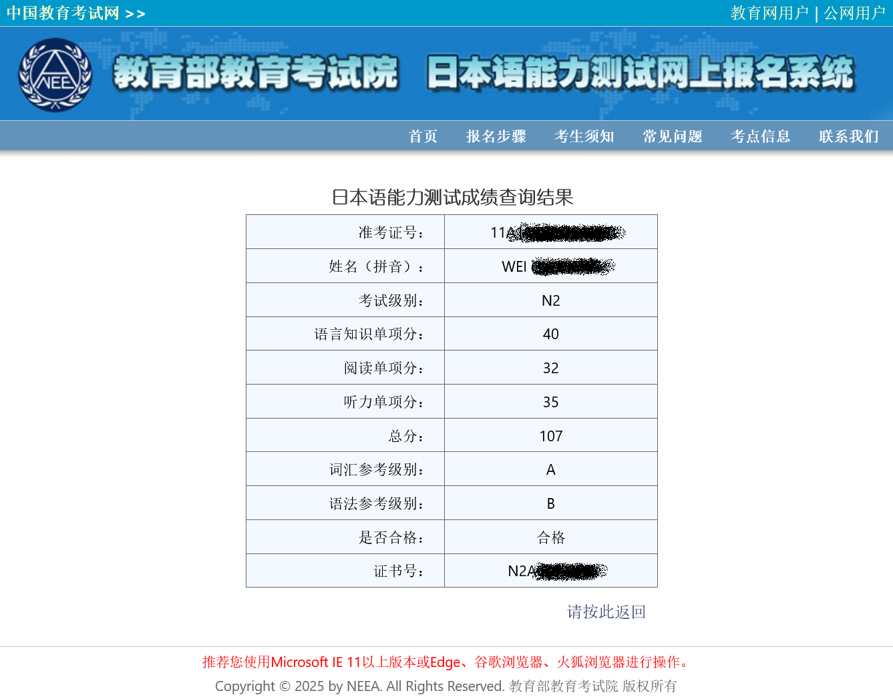

[目录](./)

# 从日语N2考试得了107分说起

7月 参加了日语N2考试，这是在换了工作到日企之后，第一次去测试自己的日语能力。 当时考试的时候，感觉很糟糕，很多问题都有些模模糊糊的，考完感觉就是考砸了。 但前几天去查了成绩以后，发现竟然考了 107 分，过了……

回顾了一下，我考出这成绩的成本，是N年的时间和352块钱的报名费和42块钱的一本考题集，23块钱的一本N2考点词汇……

OMG！  
神様、ありがとうございます！  
在看了成绩单之后，稍稍分析了一下自己的成绩。

语言知识部分，稍稍超出了我的预计，果然呆日企，天天用日语写文书，对语法训练还是有帮助的。 阅读差不多，考试的时候阅读我到后来都来不及做，看来自己的阅读能力还不算太好，但能蒙过关…… 听力自认为低了，自己分析，就是单词量的问题了，好多东西听的时候就觉出不知道说了些啥。

回想自己第一次接触あいうえお开始，估计已经快 10年 了。

高考后，因为有3个月的无聊，所以找了本日语教材，开始了日语的自学之旅。 上了大学，在时间允许的情况下，曾去旁听了半个学期的日语。不过因为专业不一样，所以也不可能每堂课都到课，学习也始终处于三天打渔，两天晒网的状态中。 不过在这期间，因为时间空得很，开始大量接触动画，并且迷上了动画。就这样，开始慢慢接触动画、漫画、小说，以及其背后的日语和日本文化。 于是，就这样点点滴滴的开始了学习过程，算是有心栽花花不发，无心插柳柳成阴。

但以这种方式学下的日语，有一个很明显的问题，就是我只知道具体用法，而无法说清楚背后为什么要这么用，知其然而不知其所以然。我知道如何使用日语，但要问我具体的语法，我就不知道了，要我用某个语法造句，那我就只能说すみません了^_^ 这点在考语法的时候，就很明显，人家专业选手考语法是靠背考点，我是靠蒙……

人家说一般学校学出来的是哑巴英语，我估计只能说我是文盲日语了……

## 11月25日追记

公司前几天内部考了一次，1000分总分，得了649（听力355/500，比试309/500），而且听力成绩比专业日语系学生都好出好多，看来多看多听，以及身边有日本人可以直接交流还是有用处的…… 不过笔试成绩就相当糟糕了，刚刚过了及格线而已。 

## 2025年4月15日追记

因为某些原因，要 N2 证书，结果 10 年过去，那张纸不知道被我塞那个犄角旮旯了……

有朋友说，可以去[教育部考试院](https://jlpt.neea.edu.cn/qryscore.jsp)查，  
然后一看，用身份证这些只能查到 2011年12月 ，而我是 2011年7月 考的……

所以只能继续在家里到处翻找，结果证书没找到，倒是找到了当年的准考证，  
再去考试院差，一下子就查到了~

图见上面的~

哈哈哈哈哈！
