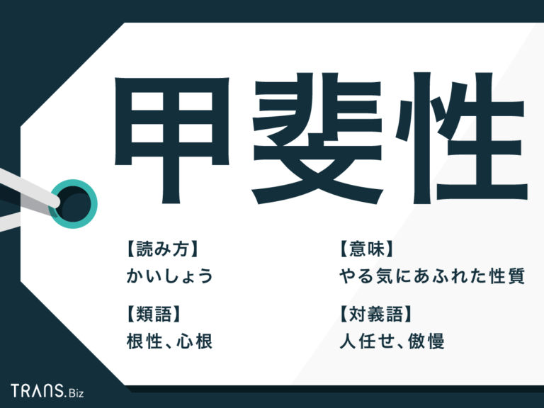

[目录](./)
# 甲斐

## 読み

かい

## 意義

```
「甲斐性」という言葉が持つ本当の意味を知っている、という人は多くないかもしれません。今回は「甲斐性」の意味や読み方、由来や類語について解説します。
「甲斐性がない」とはどういう意味なのか、「甲斐性がある男・女」とはどういう人のことを指しているのか、などについてもお伝えしますので、参考にしてください。
```



## 例文

## 翻译

効 ;甲斐
【名】
效果;价值

## 展开

年甲斐    としがい 0 年 甲斐 【名】 按年龄说该懂事的程度
甲斐性    かいしょう4 3 甲斐性 【名】 有志气;刚毅
甲斐甲斐しい    かいがいしい 5 甲斐甲斐しい 【形】 机敏的;勤快的;诚恳的;刚毅的
ふ甲斐無い    ふがいない 4 ふ甲斐無い 【形】 不中用的;没有志气的;令人泄气的(同だらしない)
友達甲斐    ともだちがい 0 友 達 甲斐 【名】 友情;够朋友
生き甲斐    いきがい1 03 生き甲斐 【名】 生存的意义;生活的价值
甲斐ない    没有成效，白费，没有价值，不成器
甲斐無い    かいない 0 甲斐無い 【形】 没有成效的;没有价值的
腑甲斐無い    不中用，没出息，没有志气，窝囊
言い甲斐    说的效果，说的好处，说的作用
甲掛け    手背的罩布

## 参照

* [https://kotobank.jp/word/%E7%94%B2%E6%96%90%E6%80%A7-457557](https://kotobank.jp/word/%E7%94%B2%E6%96%90%E6%80%A7-457557)
* [http://www.ichacha.net/jp/%E7%94%B2%E6%96%90.html](http://www.ichacha.net/jp/%E7%94%B2%E6%96%90.html)