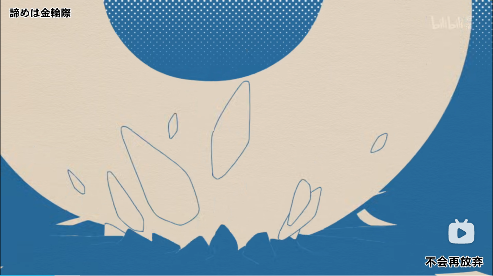

[目录](./)
# 金輪際（こんりんざい）

## 

从《佐贺偶像是传奇·卷土重来》的 OP 里看到的这个词，不认识。

## 意義

金輪際とは、決して。絶対に。二度と。後に打ち消しの語を伴なって用いる。

## 参考
* [https://gogen-yurai.jp/konrinzai/](https://gogen-yurai.jp/konrinzai/)
* [https://kotobank.jp/word/%E9%87%91%E8%BC%AA%E9%9A%9B-67654](https://kotobank.jp/word/%E9%87%91%E8%BC%AA%E9%9A%9B-67654)