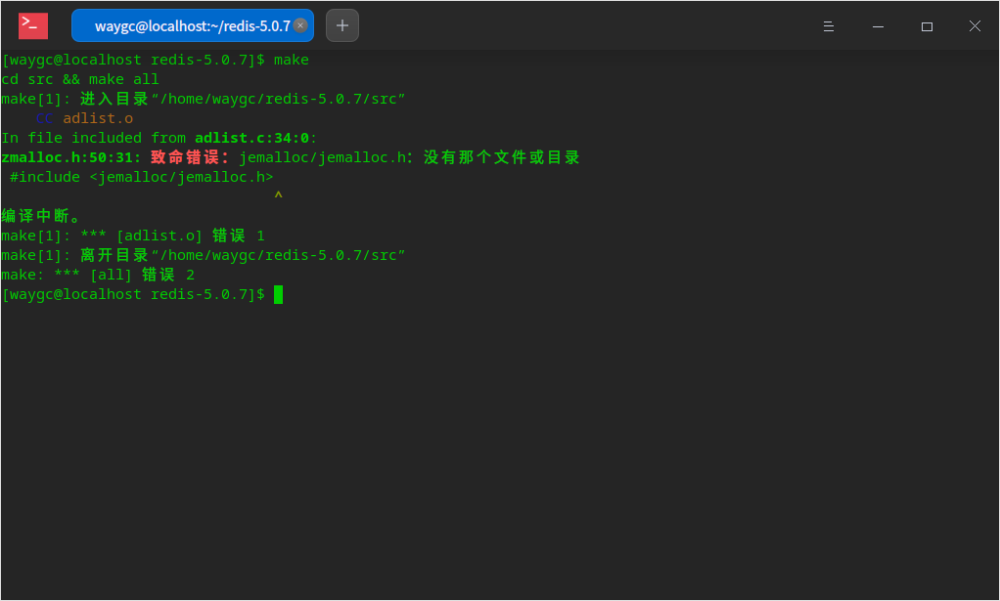
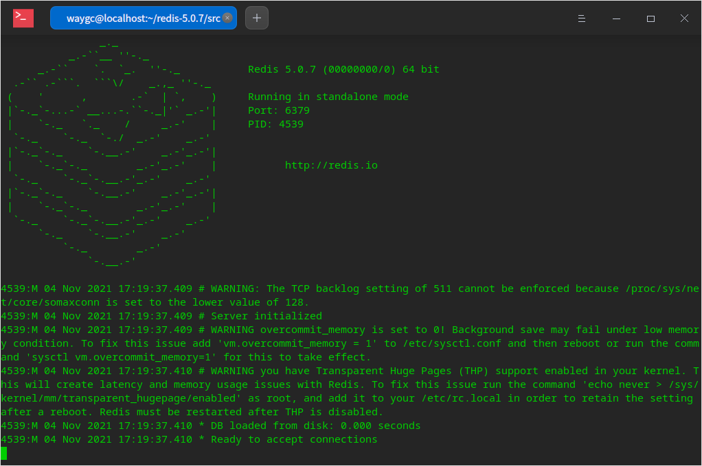

[目录](./)
# CentOS7安装redis

### 1. 下载并编译
```
wget http://download.redis.io/releases/redis-5.0.7.tar.gz
tar xzf redis-5.0.7.tar.gz
cd cd redis-5.0.7/
make
```

然后提示下面的错误：



然后网上翻阅资料后，把 `make` 改成 `make MALLOC=libc` 就可以了。  
出现这种错误可能的原因是 centos7 通过 yum 安装的 gcc 版本太低。

make完后 redis-5.0.7目录src下会出现编译后的redis服务程序redis-server，执行./redis-server就可以通过前端模式启动了，不过ssh命令窗口关闭，redis-server程序就结束了。

```
cd src
./redis-server
```



### 2. 安装到指定目录
```
# 安装到指定目录
make install PREFIX=/usr/local/redis
```

### 3. 配置环境变量

```
# 打开配置文件
vi /etc/profile
# 在文件末尾加入下面代码，:wq保存退出(无权限可:q!强制退出，换root账户重来)
export REDIS_HOME=/usr/local/redis
export PATH=$REDIS_HOME/bin:$PATH
# 使环境变量即时生效
source /etc/profile
```

### 4. 配置systemctl启动方式

将redis解压目录的redis配置文件复制过来
mkdir /usr/local/redis/etc
cp redis.conf /usr/local/redis/etc/redis.conf

#### 修改配置文件支持systemctl启动方式
sed -i -e 's:^daemonize .*:daemonize yes:' -e 's:^supervised .*:supervised systemd:' /usr/local/redis/etc/redis.conf

#### 添加自定义系统服务
把以下内容添加到 `/usr/lib/systemd/system/redis.service` 中去
```
[Unit]
Description=Redis Server Manager
After=network.target

[Service]
Type=forking
PIDFile=/var/run/redis.pid
ExecStart=/usr/local/redis/bin/redis-server /usr/local/redis/etc/reids.conf
ExecReload=/bin/kill -USR2 $MAINPID
ExecStop=/bin/kill -SIGINT $MAINPID
PrivateTmp=true

[Install]
WantedBy=multi-user.target
```
#### redis 服务
```
systemctl daemon-reload # 重新加载系统服务配置
systemctl status redis # 查看redis服务状态
systemctl start redis # 启动redis服务
systemctl stop redis # 停止redis服务
systemctl restart redis # 重新启动redis服务
systemctl enable redis # 配置redis开机自动启动
systemctl disable redis # 配置redis开机不自动启动
```

### 5. 配置外部可访问

编辑 `reids.conf`

1. 注释掉 bind 127.0.0.1
2. protected-mode 修改为 nos
3. 设置用户名密码 找到 requirepass，这是密码即可

## 参考

* [Linux服务器搭建-Redis与FastDFS](https://xuchunlei.top/2020/02/11/Linux服务器搭建-Redis与FastDFS/)