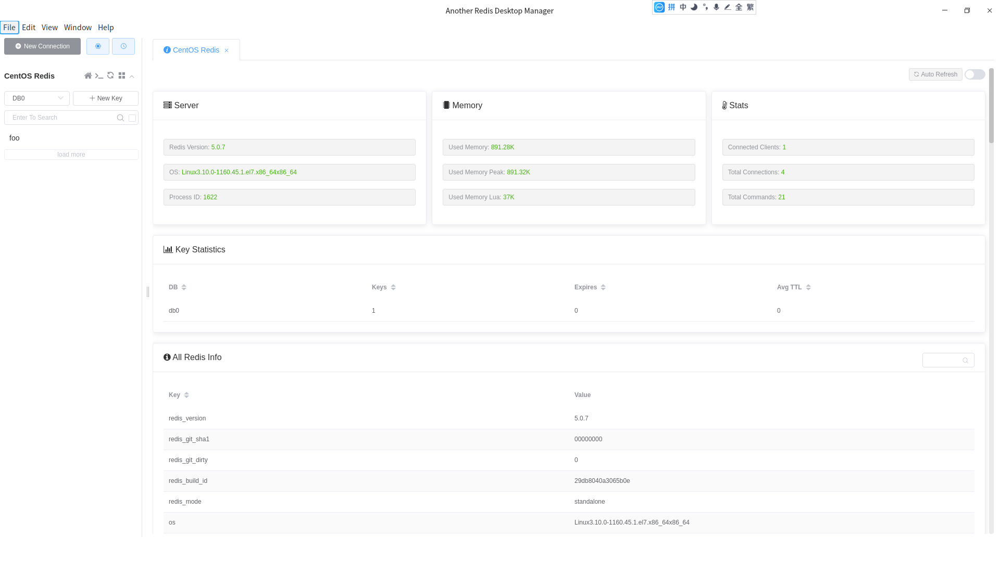

[目录](./)
# CentOS7安装redis

### 1. 下载并编译
```
wget http://download.redis.io/releases/redis-5.0.7.tar.gz
tar xzf redis-5.0.7.tar.gz
cd cd redis-5.0.7/
make
```

然后提示下面的错误：


然后网上翻阅资料后，把 `make` 改成 `make MALLOC=libc` 就 OK 啦。  
出现这种错误可能的原因是 centos7 通过 yum 安装的 gcc 版本太低。

make完后 redis-5.0.7目录src下会出现编译后的redis服务程序redis-server，执行./redis-server就可以通过前端模式启动了，不过ssh命令窗口关闭，redis-server程序就结束了。

```
cd src
./redis-server
```


### 2. 安装到指定目录
```
# 安装到指定目录
make install PREFIX=/usr/local/redis
```

### 3. 配置环境变量

```
# 打开配置文件
vi /etc/profile
# 在文件末尾加入下面代码，:wq保存退出(无权限可:q!强制退出，换root账户重来)
export REDIS_HOME=/usr/local/redis
export PATH=$REDIS_HOME/bin:$PATH
# 使环境变量即时生效
source /etc/profile
```

### 4. 配置systemctl启动方式

```
 将redis解压目录的redis配置文件复制过来
mkdir /usr/local/redis/etc
cp redis.conf /usr/local/redis/etc/6379.conf
# 修改配置文件支持systemctl启动方式
sed -i -e 's:^daemonize .*:daemonize yes:' -e 's:^supervised .*:supervised systemd:' /usr/local/redis/etc/6379.conf

# 添加自定义系统服务
cat > /usr/lib/systemd/system/redis_6379.service <<EOF
[Unit]
Description=Redis Server Manager
After=network.target

[Service]
Type=forking
PIDFile=/var/run/redis_6379.pid
ExecStart=/usr/local/redis/bin/redis-server /usr/local/redis/etc/6379.conf
ExecReload=/bin/kill -USR2 $MAINPID
ExecStop=/bin/kill -SIGINT $MAINPID
PrivateTmp=true

[Install]
WantedBy=multi-user.target
EOF

# 重新加载系统服务配置
systemctl daemon-reload

# 查看redis服务状态
systemctl status redis_6379
# 启动redis服务
systemctl start redis_6379
# 停止redis服务
systemctl stop redis_6379
# 重新启动redis服务
systemctl restart redis_6379
# 配置redis开机自动启动
systemctl enable redis_6379
# 配置redis开机不自动启动
systemctl disable redis_6379
————————————————
版权声明：本文为CSDN博主「Wenx408」的原创文章，遵循CC 4.0 BY-SA版权协议，转载请附上原文出处链接及本声明。
原文链接：https://blog.csdn.net/jwx90312/article/details/104225549
```

### 5. 配置外部可访问

编辑 `redis.conf`

```
1. 注释掉
bind 127.0.0.1

2. protected-mode 修改为 no

3. 注释掉 requirepass
```

就可以让其他的机器访问了。

