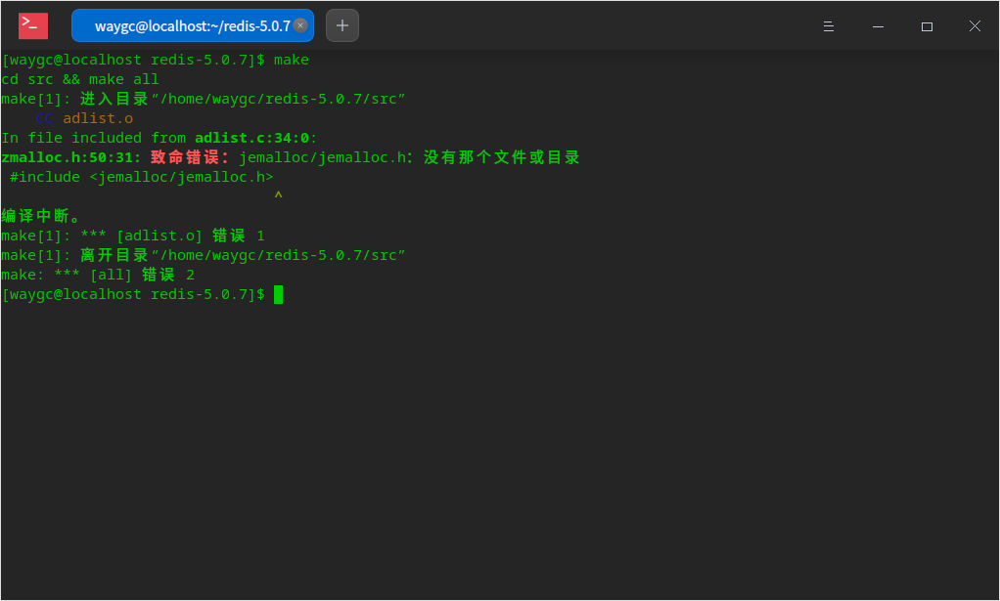
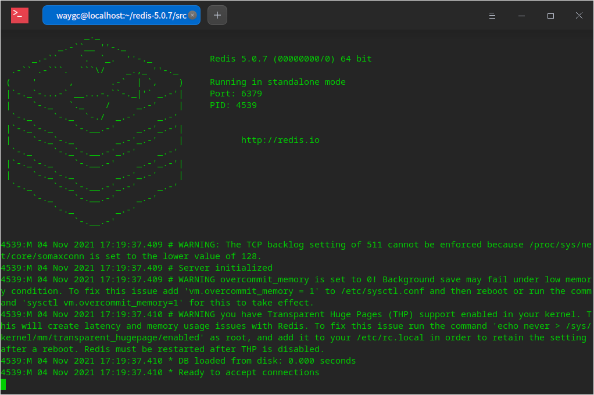

```
wget http://download.redis.io/releases/redis-5.0.7.tar.gz
tar xzf redis-5.0.7.tar.gz
cd cd redis-5.0.7/
make
```

然后提示下面的错误：



然后网上翻阅资料后，把 `make` 改成 `make MALLOC=libc` 就 OK 啦。  
出现这种错误可能的原因是 centos7 通过 yum 安装的 gcc 版本太低。

make完后 redis-5.0.7目录src下会出现编译后的redis服务程序redis-server，执行./redis-server就可以通过前端模式启动了，不过ssh命令窗口关闭，redis-server程序就结束了。

```
cd src
./redis-server
```

