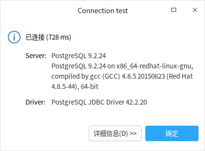

[目录](./)
# CentOS7安装和运行postgresql

1、导入yum源
```
sudo yum install -y https://download.postgresql.org/pub/repos/yum/reporpms/EL-7-x86_64/pgdg-redhat-repo-latest.noarch.rpm
```
2、安装PostgreSQL服务
```
sudo yum install -y postgresql12 postgresql12-server
```

3、初始化数据库
```
sudo /usr/pgsql-12/bin/postgresql-12-setup initdb 

#Initializing database ... OK
```
4、启动PostgreSQL服务
```
#启动PostgreSQL服务
sudo systemctl start postgresql-12

#设置PostgreSQL服务为开机启动
sudo systemctl enable postgresql-12
```
-------------------------------------------------
### 以下为 postgres 9.5 的操作
使用 root 权限安装软件：
```
yum install posrgresql
yum install posrgresql-server # 这步一定要

service postgresql initdb
service postgresql start
```

安装好的程序在 `/var/lib/pgsql/` 这个位置。  
这样 postgresql 就算是安装好了，但执行 `psql` 命令会报错。

```
psql: FATAL:  role "root" does not exist
```

切换到 postgres 用户就可以了。

修改 `/var/lib/pgsql/data/pg_hba.conf` 这个文件，可以让外网访问到数据库。  
参考文档：[19.1. pg_hba.conf文件](http://www.postgres.cn/docs/9.4/auth-pg-hba-conf.html)

简单来说就是添加
```
host    all all   0.0.0.0/0 md5
```

然后修改 `postgresql.conf` ，将
```
#listen_addresses='localhost'
```
改为
```
listen_addresses='*'
```

这样，外部就可以访问 postgres 了。  


要开机自启动，执行一下命令：
```
systemctl enable postgresql.service
```