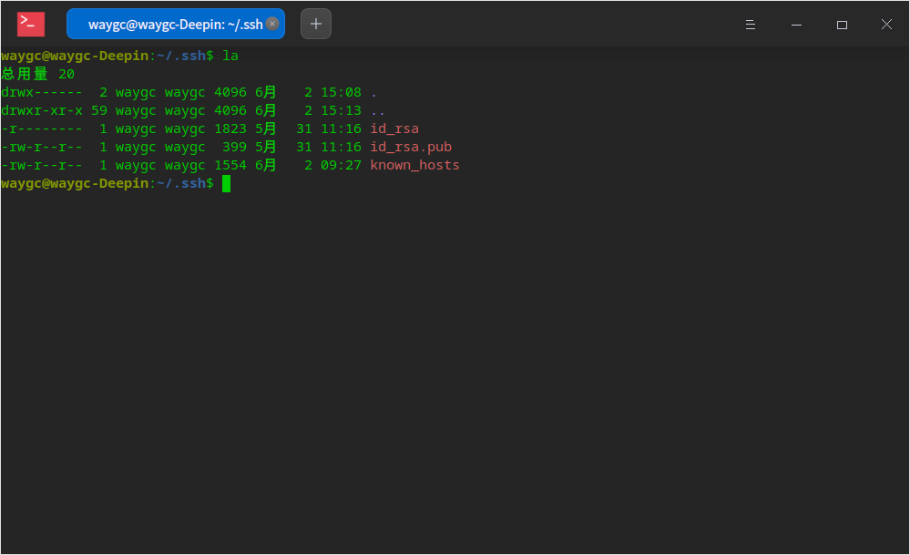
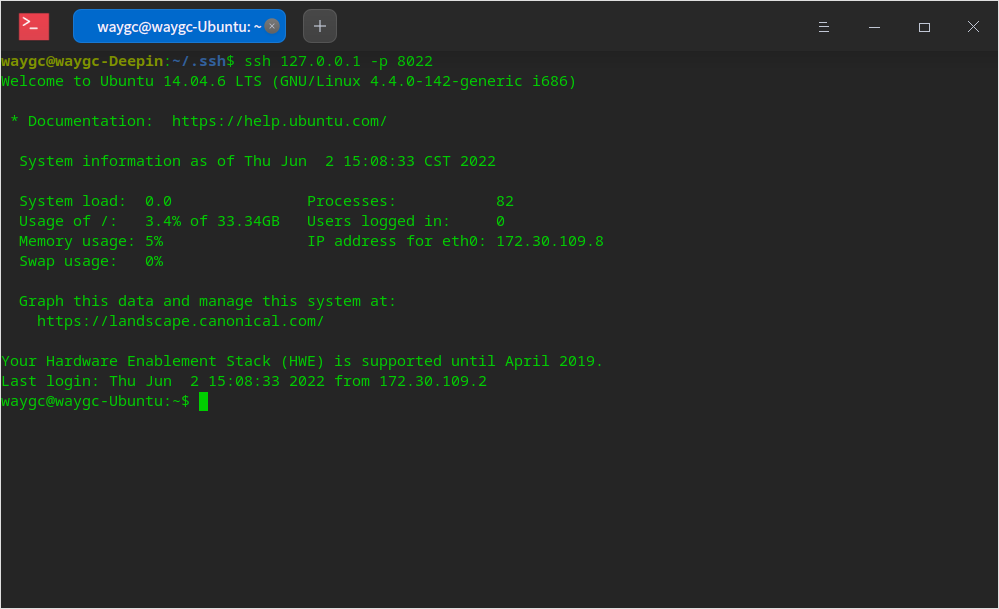

[目录](./)
# SSH免密登陆

## 1, 重置

删除`本机`和`服务器`中 `/home/用户名/.ssh` 下的所有文件。

## 2, 生成密码对

```
[usera@hostname ~]$ ssh-keygen -t rsa
Generating public/private rsa key pair.
Enter file in which to save the key (/home/usera/.ssh/id_rsa): 
Created directory '/home/usera/.ssh'.
Enter passphrase (empty for no passphrase): 
Enter same passphrase again: 
Your identification has been saved in /home/usera/.ssh/id_rsa.
Your public key has been saved in /home/usera/.ssh/id_rsa.pub.
The key fingerprint is:
39:f2:fc:70:ef:e9:bd:05:40:6e:64:b0:99:56:6e:01 usera@serverA
The key's randomart image is:
+--[ RSA 2048]----+
|          Eo*    |
|           @ .   |
|          = *    |
|         o o .   |
|      . S     .  |
|       + .     . |
|        + .     .|
|         + . o . |
|          .o= o. |
+-----------------+
```



## 3, 复制公钥

把生成的共钥复制到服务器上

```
ssh-copy-id userb@127.0.0.1 -p 8022
```

