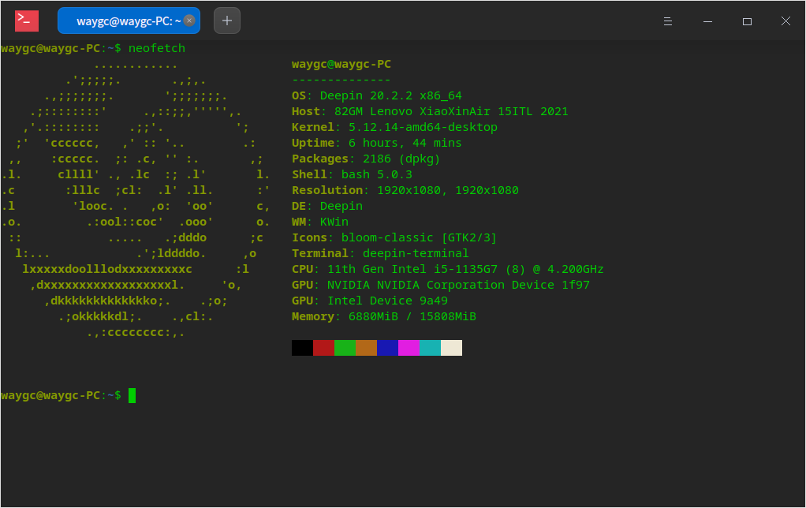

[上一层](../)

# 挨踢技术

## 目录

* [前端](./前端)
* [nodejs](./nodejs)
* [Linux](./Linux)
* [基础学习](./基础学习)
* [数据库](./数据库)
* [工具软件](./工具软件)
* [我的规范](./我的规范)
* [安全](./安全)
* [项目管理](./项目管理)
* [其他](./其他)

## 文档
* [技术博客](./文档/技术博客)
* [翻译文档(./文档/翻译文档)
