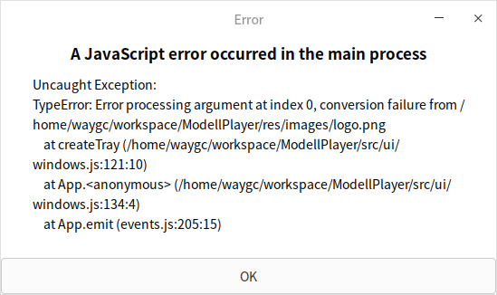

[目录](./)
# linux下系统托盘的问题

在 windows 下，建立系统托盘的代码是这样的

```
const iconPath = path.join(__dirname, `./../..${UiConfig.base.ico}`);
tray = new Tray(iconPath);
```

但 linux 下会报错。  


按 gayhub 上的[提示](https://github.com/electron/electron/issues/9795) ，这里将参数从 string 修改为 nativeimage 就好了

```
const { nativeImage } = require('electron');

const iconPath = path.join(__dirname, `./../..${UiConfig.base.ico}`);
let nimage = nativeImage.createFromPath(iconPath);
tray = new Tray(nimage);
```

还要注意的是，**在 linux 下，系统托盘的图标可能显示不正常**，不过系统系统托盘自身还是建立成功的。

多次编译后，经常会出问题，原因未知。

```
function createTray() {
	// 创建 tray
	const iconPath = path.join(__dirname, ICON_PATH);
	let nimage = nativeImage.createFromPath(iconPath);
	tray = new Tray(nimage);
	// 设置托盘菜单
	// tray.setToolTip("锚点播放器");
	const menu = Menu.buildFromTemplate(appmenu.tray(windows));
	tray.setContextMenu(menu);
	// tray.on("right-click", () => {
	// 	const menu = Menu.buildFromTemplate(appmenu.tray(windows));
	// 	tray.setContextMenu(menu);
	// });
	// TODO click 事件在 linux 下好像无效？
	// TODO 这里的设置时灵时不灵，原因未知
	// tray.on("click", (event, bounds, position)=>{
	// 	exit();
	// });
}
```