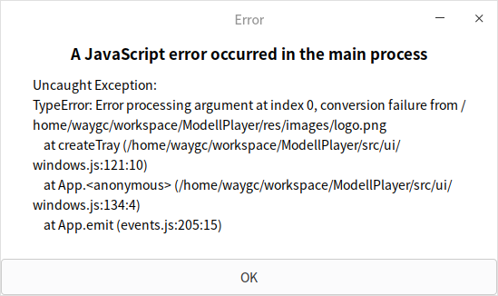

[目录](./)
# linux下系统托盘的问题

在 windows 下，建立系统托盘的代码是这样的

```
const iconPath = path.join(__dirname, `./../..${UiConfig.base.ico}`);
tray = new Tray(iconPath);
```

但 linux 下会报错。  


按 gayhub 上的[提示](https://github.com/electron/electron/issues/9795) ，这里将参数从 string 修改为 nativeimage 就好了

```
const { nativeImage } = require('electron');

const iconPath = path.join(__dirname, `./../..${UiConfig.base.ico}`);
let nimage = nativeImage.createFromPath(iconPath);
tray = new Tray(nimage);
```

还要注意的是，**在 linux 下，系统托盘的图标可能显示不正常**，不过系统系统托盘自身还是建立成功的。
