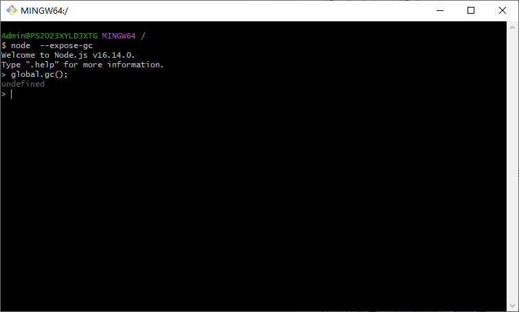

[目录](./)
# global.gc的问题

之前从网络上看资料说 `global.gc()` 可以调用垃圾清理。

但实际调用 `global.gc()` 的时候会有下面的错误提示：  


事实上用不了这个函数，原因未知。

还有一个问题，在官方 API （[http://nodejs.cn/api/globals.html#globals_global_objects](http://nodejs.cn/api/globals.html#globals_global_objects)）中，没有 `global.gc()` 这个函数。


但至少 soc 上面却有一堆关于 `global.gc()` 的问题：[https://stackoverflow.com/search?q=global.gc](https://stackoverflow.com/search?q=global.gc)  
有些糊涂。

查到 `global.gc` 是必须在开启 `--expose-gc` 的时候猜有效。



不过，后续延伸至服务器端，如果用 PM2 要怎么启动 `--expose-gc` ？

```
pm2 start -i 1 -o ./logs/out.log -e ./logs/err.log ./index.js --name [online]
```

研究后应该可以这么写

```
 pm2 start -i 1 -o ../logs/out.log -e ../logs/err.log ./index.js --name [online]  --node-args="--expose-gc"
```