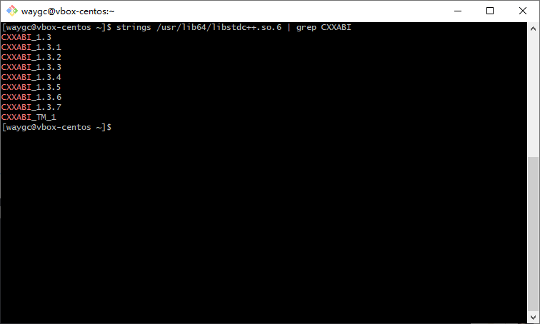
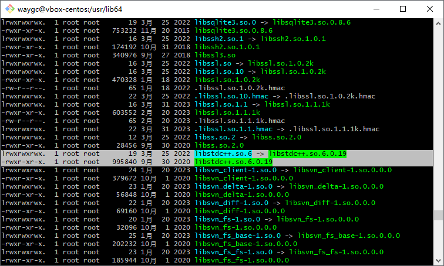
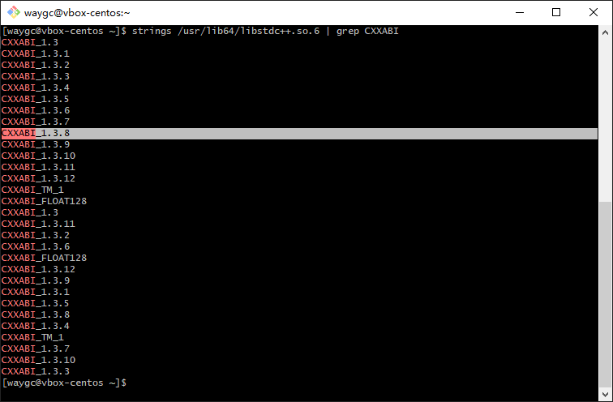

[目录](./)

# version `CXXABI_1.3.8' not found

## 现象

部署 nodejs 的时候，提示了这么个错误
```
/lib64/libstdc++.so.6: version `CXXABI_1.3.8' not found (required by /home/stones/server/node_modules/sqlite3/build/Release/node_sqlite3.node)
[2024-07-19 11:01:43.377] ERROR Error: /lib64/libstdc++.so.6: version `CXXABI_1.3.8' not found (required by /home/stones/server/node_modules/sqlite3/build/Release/node_sqlite3.node)
    at Object.Module._extensions..node (node:internal/modules/cjs/loader:1185:18)
    at Module.load (node:internal/modules/cjs/loader:981:32)
    at Function.Module._load (node:internal/modules/cjs/loader:822:12)
    at Module.require (node:internal/modules/cjs/loader:1005:19)
    at Module.Hook._require.Module.require (/opt/node-v12.17.0-linux-x64/lib/node_modules/pm2/node_modules/_require-in-the-middle@5.1.0@require-in-the-middle/index.js:80:39)
    at require (node:internal/modules/cjs/helpers:102:18)
    at bindings (/home/stones/server/node_modules/bindings/bindings.js:112:48)
    at Object.<anonymous> (/home/stones/server/node_modules/sqlite3/lib/sqlite3-binding.js:1:37)
    at Module._compile (node:internal/modules/cjs/loader:1103:14)
    at Object.Module._extensions..js (node:internal/modules/cjs/loader:1155:10)
/lib64/libstdc++.so.6: version `CXXABI_1.3.8' not found (required by /home/stones/server/node_modules/sqlite3/build/Release/node_sqlite3.node)
```

查了以下，发现是 `libstdc++.so.6` 版本太低造成的。

## 调查和解决

首先看的 libstdc++.so.6 里是否包含了 CXXABI_1.3.8
```
strings /usr/lib64/libstdc++.so.6 | grep CXXABI
```



然后就跑去 `/usr/lib64` 目录下看了下，`libstdc++.so` 的版本只到 6.0.19 。



那知乎只要找到比 6.0.19 高一个版本的就应该可以了。  
于是上网一找，下了个 6.0.26 的 zip 包。  
解压、安装、软链接一通操作后。

```
unzip libstdc.so_.6.0.26.zip
mv libstdc++.so.6.0.26 /usr/lib64/
rm /usr/lib64/libstdc++.so.6
ln -s /usr/lib64/libstdc++.so.6.0.26 /usr/lib64/libstdc++.so.6
```

然后再执行一遍
```
strings /usr/lib64/libstdc++.so.6 | grep CXXABI
```

看到了 1.3.8



再执行 node 程序，解决了～