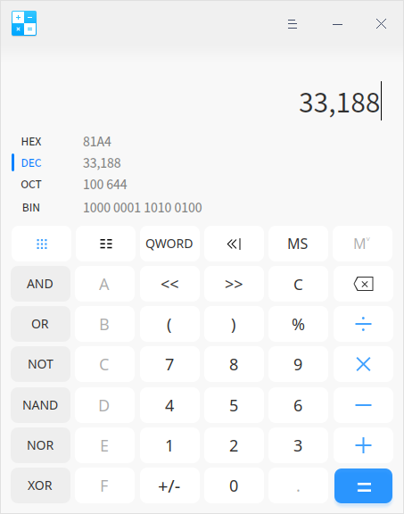
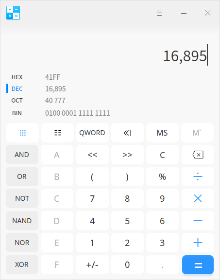

[目录](./)

# 从fs.stat的返回值中的mode说起

写 bug 的时候，通过 `fs.stat` 获得文件状态的时候，被其 `mode` 的值给吸引到了。

```
Stats {
  dev:3229478529,
  mode:33206,
  nlink:1,
  uid:0,
  gid:0,
  rdev:0,
  blksize:4096,
  ino:1970324837039946,
  size:0,
  blocks:0,
  atimeMs:1582306776282,
  mtimeMs:1582482953967,
  ctimeMs:1582482953968.2532,
  birthtimeMs:1582306776282.142,
  atime:2020-02-21T17:39:36.282Z,
  mtime:2020-02-23T18:35:53.967Z,
  ctime:2020-02-23T18:35:53.968Z,
  birthtime:2020-02-21T17:39:36.282Z
}
```

遇到文件有：33188、33279 等，  
文件夹有：16895、16877 这些。

看文档，只有非常简单的一句话：`A bit-field describing the file type and mode.`（描述文件类型和模式的位字段。）

这啥意思？  
看不懂。

于是开始全网搜索，看看有没有类似的问题。  
甚至把“A bit-field describing the file type and mode.”这句话都丢到搜索引擎里去过，  
还是找不到答案……

感觉应该和文件的权限有关，但没有任何地方提到过有关这串数字的说明。

不得已，只能去翻阅 nodejs 的源代码，看看能不能从源代码中找到答案。

然后当我打开 `lib/fs.js` 的时候，我就看到了这样的话：

```
// Maintainers, keep in mind that ES1-style octal literals (`0666`) are not
// allowed in strict mode. Use ES6-style octal literals instead (`0o666`).
```

8进制！

8进制！

8进制！

一切的疑惑都解开了


