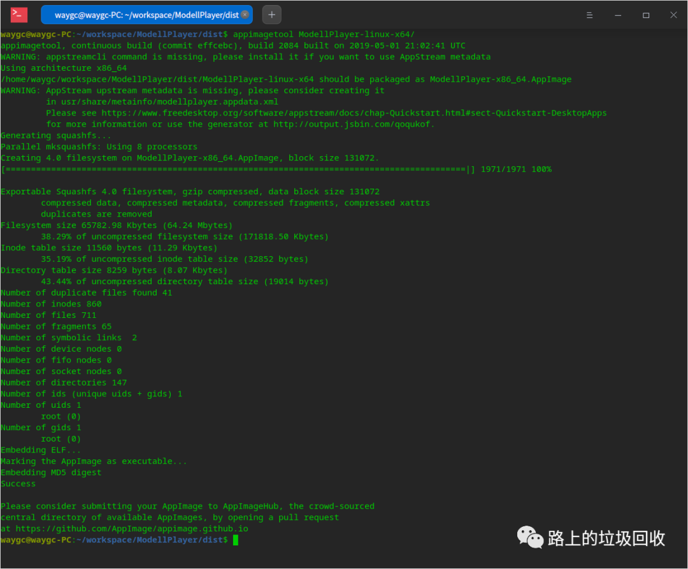

[目录](./)
# 打包一份 appimage 程序

虽然通过 了解了 AppImage 怎么打包，但毕竟之前的打包工作，都是在现有 AppImage 程序的基础上，先解压，再打包。

所以理论上没任何问题。  
但如果是拿一个程序全新打包一个 AppImage 呢？

于是在网上一番搜索后，却让我比较失望。  
教程有，但更多的都是教你打包一个 qt 程序的，而打包其他形式的教程  
则基本没有。

在 AppImage 的中文文档里，确实有类似的教程，但人家用的是 electron-builder ，而我选择的是 electron-packager 。  
这就比较尴尬了。

所以决定自己写一个文档，以为记录。

要打包 AppImage ，首先就要确认打包 AppImage 需要哪些东西。  
这点相对好确认，从已有的 AppImage 程序中解压出来的东西，基本就能当成参考。  
为此，我还特地找了一个非 qt 程序的 Kate-editor 来解压。

解压之后的文件夹所包含的内容如下图：


其中 etc 和 usr 是程序本体，可以暂时不用去管。  
剩下的几个文件中 AppRun 是脚本文件，用来启动 apprun-hooks 文件夹中的脚本。

除了上述两个文件/文件夹外，AppRun.wrapped 是运行程序的软链接。  
.DirIcon 是 logo 文件 kate.png 的软链接。  
以及一个 desktop 文件。

而通过 appimagetool 再打包 AppImage 也不再用其他的东西。  
所以猜测，是不是只要有这些，就可以打包出一个 AppImage 出来呢？  
于是开始尝试。

### 第一步：初始化

要做的就三个事情：

1. 创建文件夹
2. 拷贝 apprun-hooks 和 AppRun 到目标文件夹
3. 拷贝程序本体到目标文件夹

```
mkdir myappimage
mv ModellPlayer-linux-x64/ bin
mkdir ModellPlayer-linux-x64
mv bin ModellPlayer-linux-x64/

cp -r apprun-hooks ./ModellPlayer-linux-x64
cp AppRun ./ModellPlayer-linux-x64
cp logo.png ./ModellPlayer-linux-x64

cd ModellPlayer-linux-x64

ln -s AppRun.wrapped ./bin/MyApp
```

### 第二步：制作 desktop

把 desktop 文件的内容放在这里，可以直接复制内容使用。
```
[Desktop Entry]
Categories=Audio;
Comment=My Application
Exec=MyApp
Icon=logo
Type=Application
StartupNotify=false
GenericName=MyApp
GenericName[zh-cn]=MyApp
Name=MyApp
Name[zh-cn]=MyApp
```

### 第三步：执行打包

最后一步就是通过 appimagetool 命令来执行打包。



关于 appimageool，点[这里](/挨踢技术/Linux/appimage相关)。

这就打包好了程序，然后双击那个打包好的 AppImage 文件就可以了。