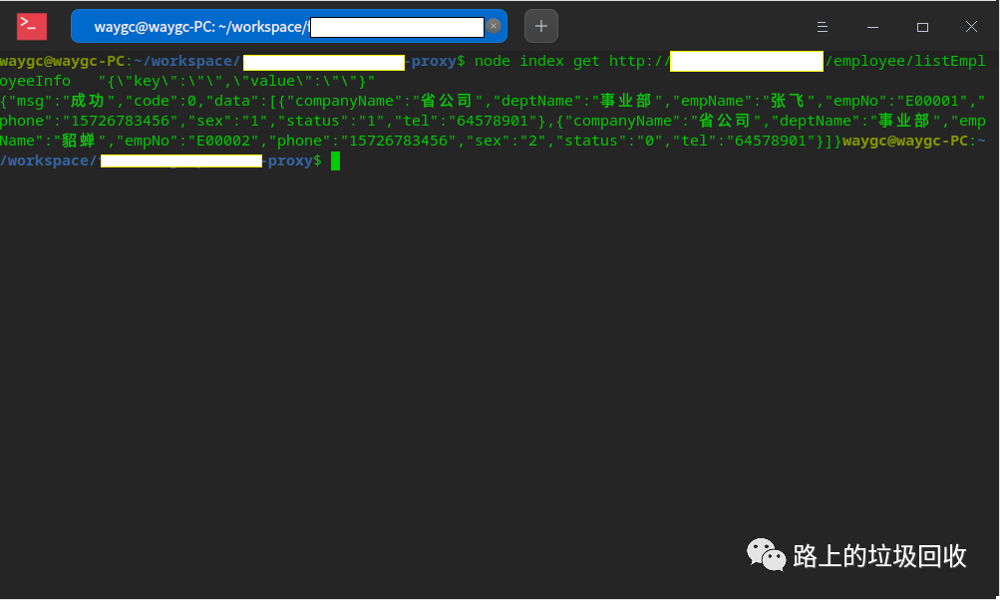
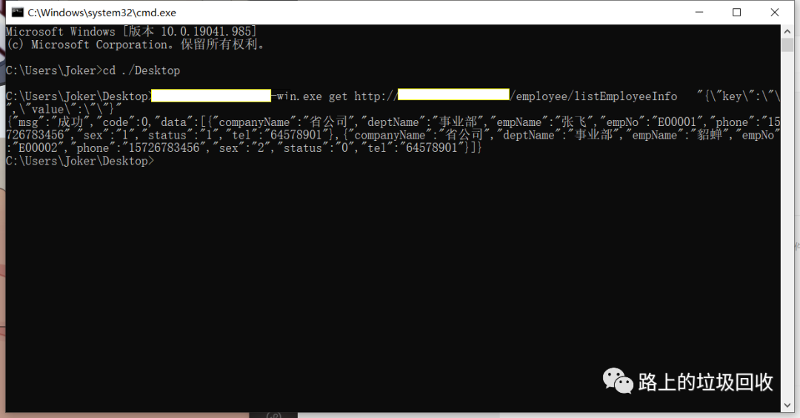

[目录](./)

# 记用nodejs转发http请求

昨天，接到了这么一个需求：

> 有一个网络请求要求接收，但甲方搞不定桌面端加解密。
> 但与此同时，这个请求有网页版本的加解密，所以转换思维方式，看看能不能将网页版的加解密用到桌面端。

思路也很简单，就是通过 nodejs 将原来的网络请求转换为桌面端的标准输出即可。
于是开始写代码。

不过，因为原来的代码都是基于网页版的，而且代码相当陈旧，没有工程化，只有单独的一个个的 js 文件。
所以直接拿来放到 node 环境中，肯定跑不起来，所以首先要做的就是恢复 window 环境。

所以这第一步就是导入 jsdom 库。

```
const { JSDOM } = require( "jsdom" );
const { window } = new JSDOM( "" );
const $ = require( "jquery" )( window );

global.$ = $;
global.window = window;
global.document = window.document;
```

如此一来，代码级的 window 和 document 就绑定到了全局对象上，在代码的调用上就可以不出问题。

第二步稍微麻烦点。
因为原来使用哦个的库都是网页版的，所以各种函数都直接调用，现在要做的就是把所有的函数全部加上 global 。

```
function setMaxDigits(value)
{
    maxDigits = value;
    ZERO_ARRAY = new Array(maxDigits);
    for (var iza = 0; iza < ZERO_ARRAY.length; iza++) ZERO_ARRAY[iza] = 0;
    bigZero = new BigInt();
    bigOne = new BigInt();
    bigOne.digits[0] = 1;
}

setMaxDigits(20);
global.setMaxDigits = setMaxDigits;
```

这里也可以使用 node 端的版本，但考虑到可能造成不同版本之间的差异等其他奇奇怪怪的因素，以及修改为 node 方式之后可能发生的代码修改而造成的二次 bug，所以为了保险起见，还是沿用了旧代码。

注意，这些加密库也得一个个导入，否则程序将无法调用到。

```
require("./security/BigInt");
```

做完这些，将代码封装出一个接口，用标准输出输出结果就可以了。

```
module.exports = {
    post: (url, data) => {
        $.sPost(url, data, (res) => {
            output(res);
        }, encryptOption);
    },
    get: (url, data) => {
        $.sGet(url, '', data, (res) => {
            output(res);
        }, encryptOption);
    }
}

function output(res) {
    process.stdout.write(JSON.stringify(res));
}
```

再写一个对外的调用接口，整个程序就算是大功告成了。

```
const args = process.argv.slice(2);

if (args.length < 2) {
    process.stdout.write("请按 参数 URL 请求数据 的格式给定参数");
    process.stdout.pause();
    return;
}

main[args[0].toLowerCase()](args[1], JSON.parse(args[2] || "{}"));
```

测试一下，成功！



然后要做的就是将这个程序打包出来了。

打包用的是 nodejs 环境下的 pkg 。

先安装 pkg

```
npm install pkg --save-dev
```

然后执行打包命令。

```
pkg -o ./dist/xxxxx  -t node12 index.js
```

需要注意的是，-t 参数后面的 node 需要添加版本号。但是不是必须和打包平台的 node 版本号一致，没考察过。

这样打包出来的程序包括了 windows 、linux 和 mac 三种平台的可执行文件。
如果只想打包 windows 平台，将 -t node12 改成 -t node12-win-x64 即可。

用打包出来的程序再测一次，没问题。


windows 下的也没问题。



OK，完美解决这个需求～