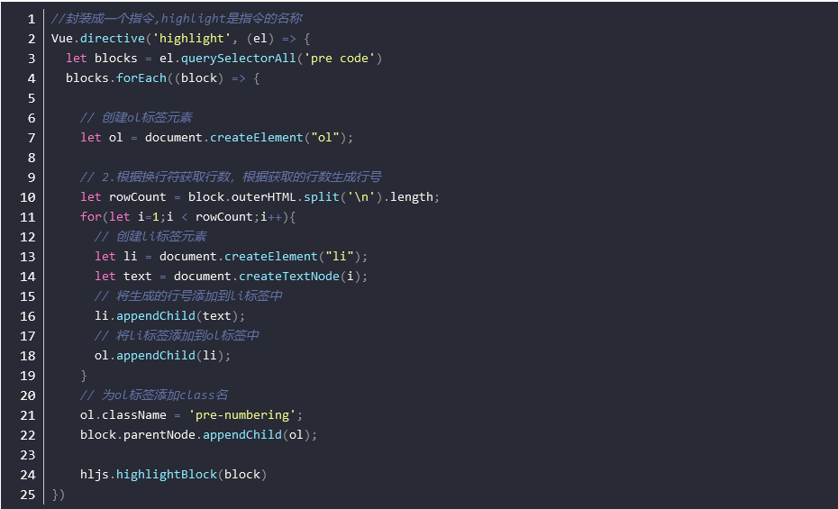
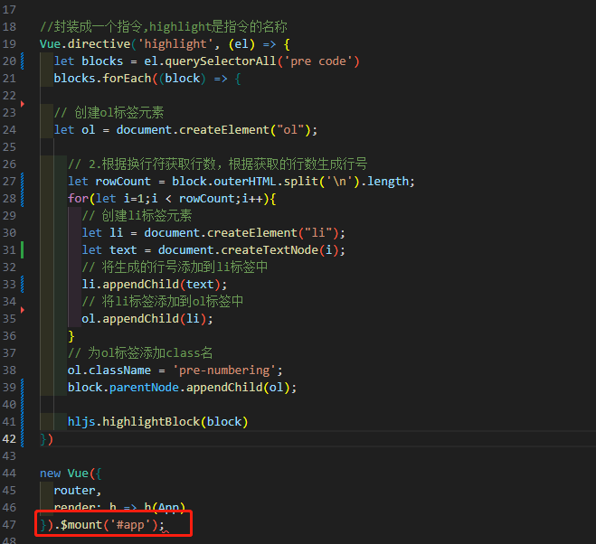
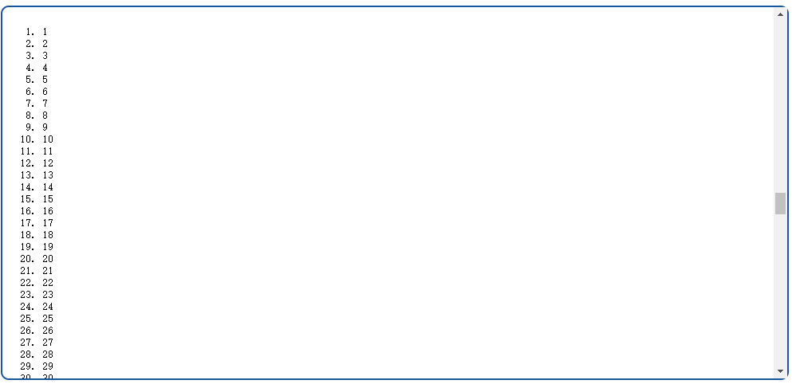
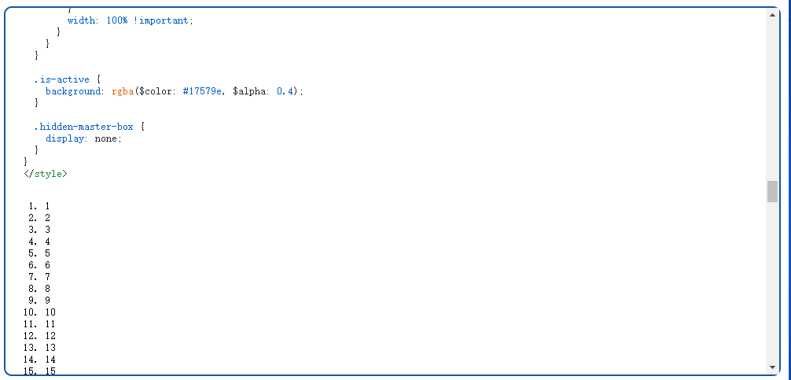
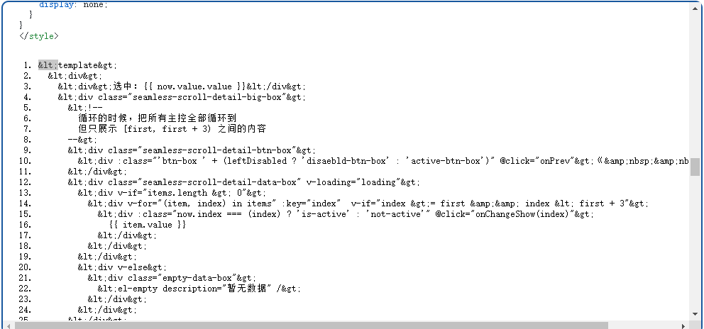

[目录](./)

# CSDN 就是依托答辩

之前和人聊天的时候，因为某个平板事件（传送门：[逆向分析防沉迷平板后，终于看到抄代码的恶果...](https://www.bilibili.com/video/BV1Q64y1n7Ah/?vd_source=aa7e6b8e229800061b9dc624a5a636fa)），说到：CSDN 就是依托答辩。

但自己还是认为，大功能（上百行）可能确实就是答辩。  
如果只是一二十行的小功能，总不会运气还这么差吧？

吧？  
………………………………

好家伙，结果几天真让我遇到了这么一坨……  
本来是想去抄一下通过 marked 来高亮代码的，找到了 CSDN 中某篇帖子，一看，似乎还挺靠谱，就粘贴复制。

结果嘛……

先把人家的代码贴在这里，齐文共欣赏。

[](https://blog.csdn.net/King__k/article/details/123475346)


代码看完了吧，看完了开始分析一下这段代码。

对了，如果你把上面的代码直接粘贴复制到自己的代码里，会报语法错误。  


为啥捏？  
因为作者没有把最后一行的`})`给贴上来。  
所以，呵呵……

这还算是开胃菜，接下来开始正式分析代码。

首先，第 14 行，作者你告诉我，你这里塞个 i 进去干嘛？  
这样一来，输出的不就变成了下面这样了么？


哦，对了，我差点忘了问，作者你的 i 为啥从 1 开始？  
如果是为了避免拿到第一行，那你最后为啥又不在 rowCount 上剪1，去掉最后一行呢？

当然，可以说这就是为了展示一下 ol 列效果而已，最后的替换要自己干云云，那我也就认了吧……

但请作者你看一下你 22 行写的代码。

appendChild？  
appendChild？  
appendChild？

这么做的结果就是把整理好的 ol 整个附加到之前 `pre code` 的后面，变成下面这样子。


等吐掉一口血后，开始改代码，然后发现了第 17 行的问题。  
这位作者，你知道 outerHTML 是什么意思么？

假设有如下代码；
```
<div id="box">
<div class="code">123</div>
</div>
```

我们的目的是要取 `<div class="code">123</div>` 这段内容。

在 \#box 上用 outerHTML ，就是取到把上面所显示的所有的代码本。  
但我们要取的是 `<div class="code">123</div>` 这段内容，刚好多了最外层的 \#box 自己的 html 代码。

所以，这里不能用 `outerHTMl`，而应该用 `innerHTML` 。

或许之前猜人家的 i 从 1开始真是因为要取到最外面的那层 html 结构？

等把这里的代码改完，一刷新页面，你就会很开心的发现，代码变成了下面这个样子。  


一口老血吐出……

接下来，就懒得再去吐槽了，直接贴上改过之后的代码：

```
//封装成一个指令,highlight是指令的名称
Vue.directive('highlight', (el) => {
  let blocks = el.querySelectorAll('pre code');
  blocks.forEach((block) => {

	// 创建ol标签元素
	let ol = document.createElement("ol");

    // 2.根据换行符获取行数，根据获取的行数生成行号
    const partList = block.innerHTML.split('\n');
    for (const part of partList) {
    // let rowCount = html.split('\n').length;
    // for(let i=1;i < rowCount;i++){
      // 创建li标签元素
      let li = document.createElement("li");
      // 将生成的行号添加到li标签中
      li.innerHTML = part;
      // li.appendChild(text);
      // 将li标签添加到ol标签中
      hljs.highlightBlock(li);
      ol.appendChild(li);
    }
    block.innerHTML = ol.outerHTML;
  });
});
```

吐槽完了，看点小电影回回血。