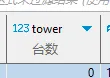

[目录](./)

# 奇葩同事之英语

某一日，看到数据库里有个字段：tower

我寻思，我们的设备上也没个塔呀，啥设备上会有个塔啊。  
于是问之，答曰：台号，第几台设备的那个台  
我：这里莫不是信号塔的意思咩？

又一日，看到数据库里有个字段：day_festival

我：这啥，我们做的是各种电池设备，和节日有啥关系？  
直到我看到了中文注释：日节能费用  
日节能费用  
日节  
日·节  
day festival

嗯，合情合理的翻译。  
按B站某位用户的说法：没毛病，翻译地信雅达。

还有个 general section，只能说网络翻译确实好样的，GJ！

双一日在数据库里看到了如下的命名

大家都是“总”字辈的，拜托别一个用 total ，一个用 always 成不？

还有“放电”，这东西你要么统一写 release，要么统一写 discharge，一会儿一个写法，真是让我无名火起。

还有 charging 和 discharge 这种词性不一致的，也真是看的我这处女座浑身难受！

叒一日，在数据库里看到了 thoroughfare 这个字段。  
基于前几日的用法，瞬间能理解这个词是“通道”的意思。

但是，这个词是”大路“的意思，大路啊！

我是不应该期望 tunnel、channel、pipeline 这些词的……

这真是一点脑子都不带的……