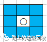
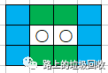
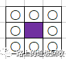

[目录](./)

# 网页式类棋类游戏的算法心得[0]=扫雷

首先名词解释一下什么叫“类棋类”。  
这是我自己发明的一个词。这里主要指代一些有一个矩形的网格“棋盘”（范围），并在这之上进行的游戏。

第一个要说的，就是扫雷。  
扫雷游戏说简单不简单，但说难，也真心不算难。  
为什么选择扫雷作为第一篇呢？因为扫雷的雷在生成之后，就完全固定了，所以代码逻辑很容易写。

既然要实现扫雷，那首先就得问，需要些什么？  
我曾经在【玩游戏不如写游戏】CmdMine，一个有点辣眼睛的扫雷游戏内核  一文中提过一嘴关于扫雷的事儿，但说的并不详细，这次就来详细说说扫雷的一些算法实现相关。  
特别说明：因为上面的代码是 Java，而网页实现是JS，所以我将直接使用 JS 代码来进行说明。

要有游戏，那就需要两个东西：棋盘和棋子  
棋盘非常好办，定义一个数组就可以了。

```
function _Board(count, width, height) {

    let size = width * height; // 棋盘大小
    let _board = new Array(size); // 棋盘状态

    return {
    };
}
```

解释一下上面的代码。  
定义了一个名叫_Board 的函数用来构建棋盘，这个函数有三个参，分别是 count、width和height，用来表示 地雷数量、棋盘宽度和棋盘高度。
最后返回一个对象，作为棋盘的实例。  
函数中还定义了四个私有变量， found 表示被找到的雷，size 是棋盘大小（格子数），close 是未翻开的格子，_board 用来储存所有的格子。

然后就到了关键的地方了，棋盘已经建立好了，怎么建立雷？  
然后扫雷的时候，雷的周围又要怎么去提示雷？

一个思路：
>
> 先抽取去一个最小环节来看看吧。
> 
> 
> 
> 从上图中可以看出，中间是雷位。周围8个蓝色格子都要标记为1，表示周围有1颗雷，这就是最简单的模型。  
> 而如果增加雷，则可以变成这种样式。
> 
> 
> 
> 中间两个是雷，蓝色的依然表示周围有1颗雷，而多出来的绿色表示绿色格子周围有2颗雷。
> 
> 
> 
> 以此类推，最后可以推出8颗雷围着1个空白格子，而紫色格子里所表示的数字，就应该是8，表示周围有8颗雷 。  
> 从上面的思路来看， 标识周围有雷的格子（颜色格），是通过周围有雷的数量来判断的，那就好，只要有雷就可以了。  
> 在有雷的地方，周围8个格子标识值+1就可以了。

说到这里，那基本算法就出来了：

> 先随机出所有雷位，以雷位为中心，将雷位周围的8个格子的标示值+1  
> 如果某个格子已经有雷，那跳过这个位置不进行雷数标示

暂时定这么两条，然后就可以写代码了。

```
function _Status(staVal) {

    let value = 0;

    if (staVal) {
        value = -1;
    }

    return {
        setWarning: () => {
            if (value === -1 || value === 8) return;
            value += 1;
        }
    };
}
```

解释一下，函数的参数 staVal表示该位置是否是雷。  
私有变量 value 就表示这个位置该设置多少值。  
而返回的对象中有一个叫 setWarning的方法，就是为每个格子设置警告标志。  
而方法第一行表示当标示值达到8，或者为雷（-1）的时候，不再增加标示值，否则就将标示值+1。

然后再在 棋盘函数中添加下面这么一段代码，来初始化棋盘，并在棋盘中加雷。

```
// 这个数组是用来记录哪些是雷的
let map = new Array(size).fill(false);
for (let i = 0; i < count;) {
    let num = Math.trunc(Math.random() * size);
    if (!map[num]) {
        map[num] = true;
        i++;
    }
}

for (let i = 0; i < size; i++) {
    _board[i] = _Status(map[i]);
}

// 分开来写是因为要先全部初始化好 _board 再设置雷
for (let i = 0; i < size; i++) {
    if (map[i]) {
        setMine(i);
    }
}

function setMine(at) {
    let x = at % width;
    let y = Math.trunc(at / width);

    if (y > 0) {
        if (x > 0) {
            _board[where(x - 1, y - 1)].setWarning();
        }
        _board[where(x, y - 1)].setWarning();
        if (x < width - 1) {
            _board[where(x + 1, y - 1)].setWarning();
        }
    }

    if (x > 0) {
        _board[where(x - 1, y)].setWarning();
    }
    if (x < width - 1) {
        _board[where(x + 1, y)].setWarning();
    }
    if (y < height - 1) {
        if (x > 0) {
        _board[where(x - 1, y + 1)].setWarning();
    }
    _board[where(x, y + 1)].setWarning();
        if (x < width - 1) {
            _board[where(x + 1, y + 1)].setWarning();
        }
    }
}
```
这样，整个棋盘就全部初始化好了。

棋盘设置好了之后，就可以执行翻开操作了，具体的前端鼠标操作略过，直接讲述如何进行翻开。  
整理思路如下

> 判断该位置是否是雷，是雷则直接提示“踩到雷，游戏结束”；  
> 如果不是雷，则翻开，并显示标示值，如果标示值=0，则不显示；  
> 如果不是雷，且标示值=0则继续翻开周围的8颗个格子，并采用瀑布式展开，直到边界；  
> 如果不是雷，且标示值>0，则翻开到此结束，不再向周边展开；  
> 如果遇到已经翻开的格子，则跳过第3、4步

翻译成代码，也非常简单
```
function open(x, y) {

    if (board.isOpened(x, y)) return;

    if (board.isMine(x, y)) {
        gameOver(x, y);
    }

    if (x < 0 || x > width - 1 || y < 0 || y > height - 1) return;
    if (board.isOpened(x, y)) return;

    if (board.open(x, y)) {

        open(x - 1, y - 1);
        open(x - 1, y);
        open(x - 1, y + 1);
        open(x, y - 1);
        open(x, y + 1);
        open(x + 1, y - 1);
        open(x + 1, y);
        open(x + 1, y + 1);
    }
}
```
好，至此，整个扫雷的思路已经大致齐全，剩下的就是整理代码，并添加诸如鼠标右键、标记雷位、取消标记等操作，这里就此略过。  
如果有兴趣，可以到码云上查看全部代码：[https://gitee.com/undeadway/jsgames/tree/master/Minesweeper](https://gitee.com/undeadway/jsgames/tree/master/Minesweeper)

最后贴张成品效果图。

> 
> 
> 