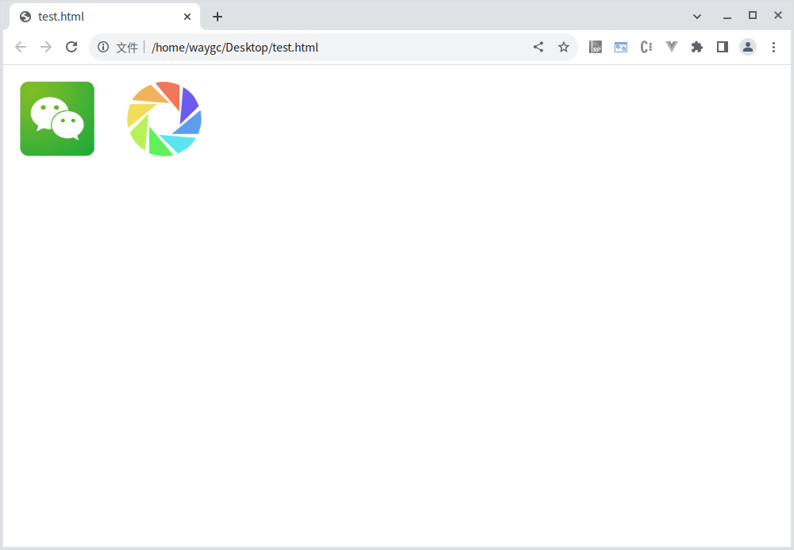

[目录](./)
# CSS大图切片

### 图片


### 代码

```
<html>
<body>
<div class="share-box share-wechat-box"></div>
<div class="share-box share-moments-box"></div>
</body>
<style>
.share-box {
	width: 120px;
	height: 120px;
	display:inline-block;
	margin-right:10px;
	background-size: auto 120px;
	background-image: url(./icons.png);
}

.share-wechat-box {
	background-position:-120px 0px;
}

.share-moments-box {
	background-position:-240px 0px;
}

</style>
</html>
```

### 实际效果
