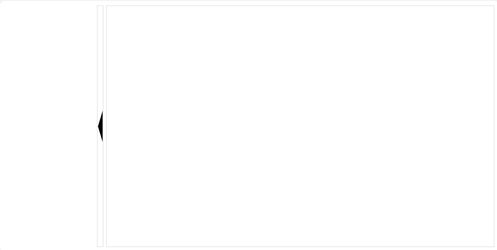

[目录](./)

# CSS实现页面开合收放

不知道怎么命名，竖着的手风琴？  
反正就是类似各种管理后台左侧目录收放的那种操作。



看起来挺简单，但也有不少小坑。  
所以写出来的代码一定有翔，只不过看含翔量的多少罢了

但能运行的代码就是好代码，不是么？

```
<template>
  <div class="decice-detail-box" :style="`height: ${height}px;`">
    <div>
      <div>
        <left-base :class="isStart ? (leftClose ? 'left-box-close' : 'left-box-open') : 'left-init'" />
      </div>
      <div :class="'left-btn ' + (isStart ? (leftClose ? 'left-btn-close' : 'left-btn-open') : 'btn-init')" @click="onClickBtn"></div>
    </div>
    <div :class="isStart ? (leftClose ? 'right-box-stretch' : 'right-box-shrink') : 'right-init'"></div>
  </div>
</template>
<script>
import LeftBase from './left-base';

export default {
  components: {
    LeftBase
  },
  props: {
    height: {
      type: Number,
        default: 0
      }
  },
  data () {
    return {
      isStart: false,
      leftClose: false
    }
  },
  methods: {
    onClickBtn () {
      this.isStart = true;
      this.leftClose = !this.leftClose;
    }
  }
}
</script>
<style lang="scss" scoped>
.decice-detail-box {
  >div {
    display: inline-block;
    vertical-align: top;
    height: 100%;
    &:first-child {
      padding-right: 10px;
      height: 100%;
      >div {
        height: 100%;
        display: inline-block;
        vertical-align: top;
        background-position: center right;
        background-repeat: no-repeat;
      }
      .decice-detail-data-box {
        overflow: hidden;
      }
      .left-btn {
        width: 20px;
        height: 100%;
        cursor: pointer;
        border:1px solid #CCCCCC;
      }
    }
    &:last-child {
        border:1px solid #CCCCCC;
    }
  }
}

.left-init {
  width: 300px;
}
.right-init {
  width: calc(100% - 330px);
}
.btn-init {
  background-image: url(./../../../../../assets/images/left-arrow.svg);
}

.left-box-close {
  animation:left_box_close 0.5s;
	animation-play-state:running;
	-webkit-animation:left_box_close 0.5s;
	-webkit-animation-play-state:running;
  animation-fill-mode: forwards;
}
@keyframes left_box_close
{
	0%   {
    opacity: 1;
    visibility:visible;
    width: 300px;
  }
	1%   {
    opacity: 0;
    visibility: hidden;
    width: 300px;
  }
	99% {
    opacity: 0;
    visibility: hidden;
    width: 0px;
  }
	100% {
    opacity: 0;
    visibility: hidden;
    width: 0px;
  }
}

.left-btn-close {
  animation:left_btn_close 0.5s;
	animation-play-state:running;
	-webkit-animation:left_btn_close 0.5s;
	-webkit-animation-play-state:running;
  animation-fill-mode: forwards;
}
@keyframes left_btn_close
{
	0%   {
    background-image: url(./../../../../../assets/images/left-arrow.svg);
  }
	1%   {
    background-image: url(./../../../../../assets/images/left-arrow.svg);
  }
	99% {
    background-image: url(./../../../../../assets/images/left-arrow.svg);
  }
	100% {
    background-image: url(./../../../../../assets/images/right-arrow.svg);
  }
}

.left-box-open {
  animation:left_box_open 0.5s;
	animation-play-state:running;
	-webkit-animation:left_box_open 0.5s;
	-webkit-animation-play-state:running;
  animation-fill-mode: forwards;
}
@keyframes left_box_open
{
	0%    {
    opacity: 0;
    visibility:hidden;
    width: 0px;
  }
	99%  {
    opacity: 0;
    visibility:hidden;
    width: 300px;
  }
	100%  {
    opacity: 1;
    visibility:visible;
    width: 300px;
  }
}

.left-btn-open {
  animation:left_btn_open 0.5s;
	animation-play-state:running;
	-webkit-animation:left_btn_open 0.5s;
	-webkit-animation-play-state:running;
  animation-fill-mode: forwards;
}
@keyframes left_btn_open
{
	0%    {
    background-image: url(./../../../../../assets/images/right-arrow.svg);
  }
	99%  {
    background-image: url(./../../../../../assets/images/right-arrow.svg);
  }
	100%  {
    background-image: url(./../../../../../assets/images/left-arrow.svg);
  }
}

.right-box-shrink {
  animation:right_box_shrink 0.5s;
	animation-play-state:running;
	-webkit-animation:right_box_shrink 0.5s;
	-webkit-animation-play-state:running;
  animation-fill-mode: forwards;
}
@keyframes right_box_shrink
{
	0%   { width: calc(100% - 30px);  }
	99% { width: calc(100% - 330px); }
	100% { width: calc(100% - 330px); }
}

.right-box-stretch {
  animation:right_box_stretch 0.5s;
	animation-play-state:running;
	-webkit-animation:right_box_stretch 0.5s;
	-webkit-animation-play-state:running;
  animation-fill-mode: forwards;
}

@keyframes right_box_stretch
{
	0%   { width: calc(100% - 330px); }
	1%   { width: calc(100% - 330px); }
	99% { width: calc(100% - 30px);  }
	100% { width: calc(100% - 30px);  }
}
</style>
```