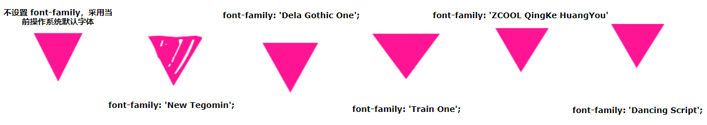

[目录](./)
# CSS画三角形

## 原文

### 1、 使用 border 绘制三角形

使用 border 实现三角形应该是大部分人都掌握的，也是各种面经中经常出现的，利用了高宽为零的容器及透明的 border 实现。

简单的代码如下：
```
    div {
      border-top: 50px solid yellowgreen;
      border-bottom: 50px solid deeppink;
      border-left: 50px solid bisque;
      border-right: 50px solid chocolate;
    }
```
高宽为零的容器，设置不同颜色的 border：


这样，让任何三边的边框的颜色为 transparent，则非常容易得到各种角度的三角形：


[CodePen Demo - 使用 border 实现三角形](https://codepen.io/Chokcoco/pen/GqrVpB)

### 2、使用 linear-gradient 绘制三角形

接着，我们使用线性渐变 linear-gradient 实现三角形。

它的原理也非常简单，我们实现一个 45° 的渐变：
```
    div {
      width: 100px;
      height: 100px;
      background: linear-gradient(45deg, deeppink, yellowgreen);
    }
```


让它的颜色从渐变色变为两种固定的颜色：
```
    div {
      width: 100px;
      height: 100px;
      background: linear-gradient(45deg, deeppink, deeppink 50%, yellowgreen 50%, yellowgreen 100%);
    }
```


再让其中一个颜色透明即可：
```
    div {
      background: linear-gradient(45deg, deeppink, deeppink 50%, transparent 50%, transparent 100%);
    }
```


## 3、使用 conic-gradient 绘制三角形

还是渐变，上述我们使用了线性渐变实现三角形，有意思的是，在渐变家族中，角向渐变 conic-gradient 也可以用于实现三角形。

方法在于，角向渐变的圆心点是可以设置的，类似于径向渐变的圆心点也可以被设置。

我们将角向渐变的圆心点设置于 50% 0，也就是 center top，容器最上方的中间，再进行角向渐变，渐变到一定的角度范围内，都是三角形图形。

假设我们有一个 200px x 100px 高宽的容器，设置其角向渐变圆心点为 50% 0：


并且，设置它从 90° 开始画角向渐变图，示意图如下：


可以看到，在初始的时候，角向渐变图形没有到第二条边的之前，都是三角形，我们选取适合的角度，非常容易的可以得到一个三角形：

    div {
        background: conic-gradient(from 90deg at 50% 0, deeppink 0, deeppink 45deg, transparent 45.1deg);
    }


上述代码中的 deeppink 45deg, transparent 45.1deg 多出来的 0.1deg 是为了简单消除渐变产生的锯齿的影响，这样，我们通过 conic-gradient，也轻松的得到了一个三角形。

同理，再配合旋转 rotate 或者 scale，我们也能得到各种角度，不同大小的三角形。

### 4、transform: rotate 配合 overflow: hidden 绘制三角形

这种方法还是比较常规的，使用 transform: rotate 配合 overflow: hidden。一看就懂，一学就会，简单的动画示意图如下：


设置图形的旋转中心在左下角 left bottom，进行旋转，配合 overflow: hidden。

完整的代码：
```
    .triangle {
        width: 141px;
        height: 100px;
        position: relative;
        overflow: hidden;
        
        &::before {
            content: "";
            position: absolute;
            top: 0;
            left: 0;
            right: 0;
            bottom: 0;
            background: deeppink;
            transform-origin: left bottom;
            transform: rotate(45deg);
        }
    }
```
### 5、使用 clip-path 绘制三角形

clip-path 一个非常有意思的 CSS 属性。

clip-path CSS 属性可以创建一个只有元素的部分区域可以显示的剪切区域。区域内的部分显示，区域外的隐藏。剪切区域是被引用内嵌的 URL 定义的路径或者外部 SVG 的路径。

也就是说，使用 clip-path 可以将一个容器裁剪成任何我们想要的样子。

通过 3 个坐标点，实现一个多边形，多余的空间则会被裁减掉，代码也非常简单：
```
    div {
        background: deeppink;
        clip-path: polygon(0 0, 100% 0, 0 100%, 0 0);
    }
```


 
### 6、利用字符绘制三角形

OK，最后一种，有些独特，就是使用字符表示三角形。

下面列出一些三角形形状的字符的十进制 Unicode 表示码。

    ◄ : &#9668; 
    ► : &#9658; 
    ▼ : &#9660; 
    ▲ : &#9650;
    ⊿ : &#8895;
    △ : &#9651;

譬如，我们使用 &#9660; 实现一个三角形 ▼，代码如下：

<div class="normal">&#9660; </div>

    div {
        font-size: 100px;
        color: deeppink;
    }

效果还是不错的：


然而，需要注意的是，使用字符表示三角形与当前设定的字体是强相关的，不同的字体绘制出的同一个字符是不一样的，我在Google Font上随机选取了几个不同的字体，分别表示同一个字符，得到的效果如下：



可以看到，不同字体的形状、大小及基线都是不一样的，所以如果你想使用字符三角形，确保用户的浏览器安装了你指定的字体，否则，不要使用这种方式。

## 问题

### 第一个问题

但随之而来的就是一个问题，假设我要画类似下面的一个形状。


除开最后直接用三角形图像的方案，前 5 种方案都只能设置直角三角形两条直角边的长度，而无法直接设置底边的长度。

这样一来，底边的长度就存在了 `√2` 。

然后显示出来的图像，就存在了对不起的问题……


### 解决方案

在网上查资料的时候发现，`font-size` 属性竟然可以是小数！

如果可以用小数，那就好办了，直接把字体大小 除以 1.414 就 OK 了。

虽然得到的还是个近似值，但人眼睛已经看不出来了。


### 第二个问题

但随之而来的就有了第二个问题：如果字体大小是动态的呢？

再次看上面的这些实现方案会发现，所以的方案的三角形画法，都是需要和 div 的高宽强绑定。

但如果高、宽的大小不确定，比如我需要动态调整字体大小。  

这么一来，样式就会变形，再次完蛋……

而目前还没啥好的解决方案……

## 参考资料

* [https://zhuanlan.zhihu.com/p/37638283](https://zhuanlan.zhihu.com/p/37638283)
* [https://blog.csdn.net/weixin_44015669/article/details/115663156](https://blog.csdn.net/weixin_44015669/article/details/115663156)