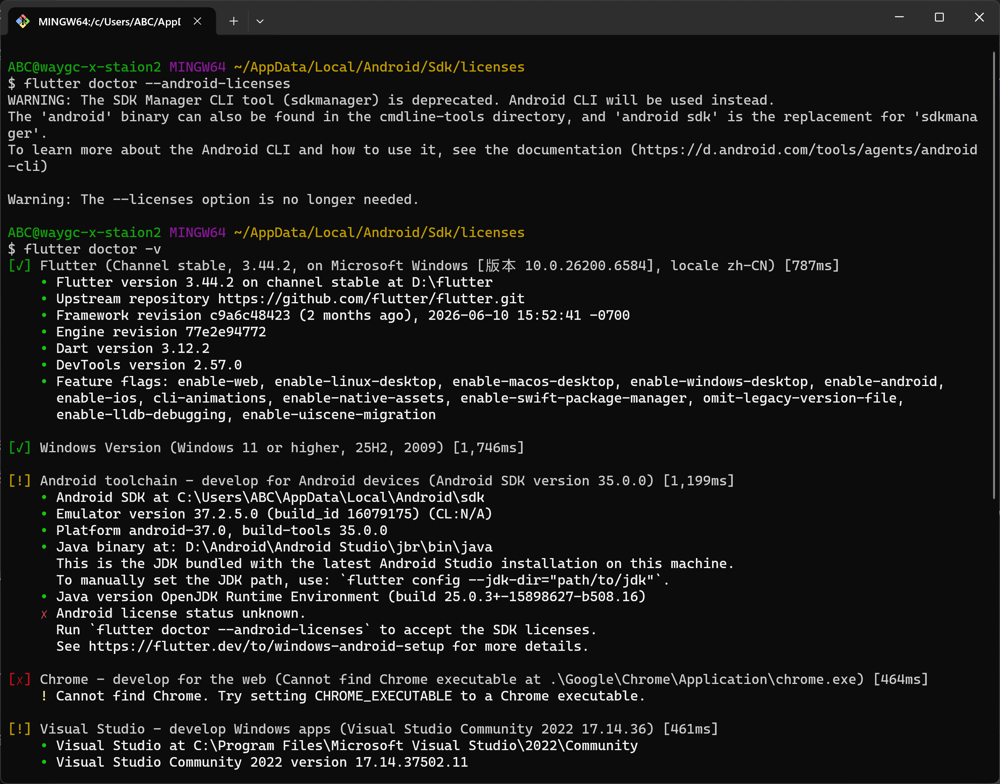
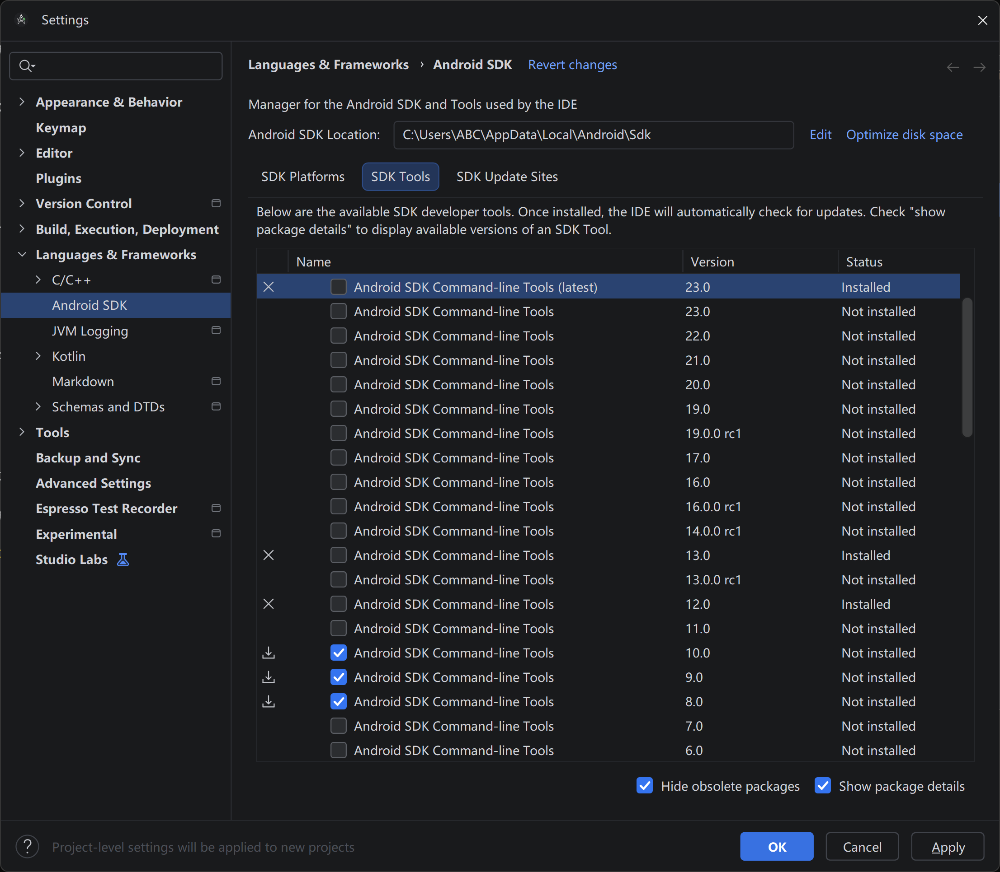
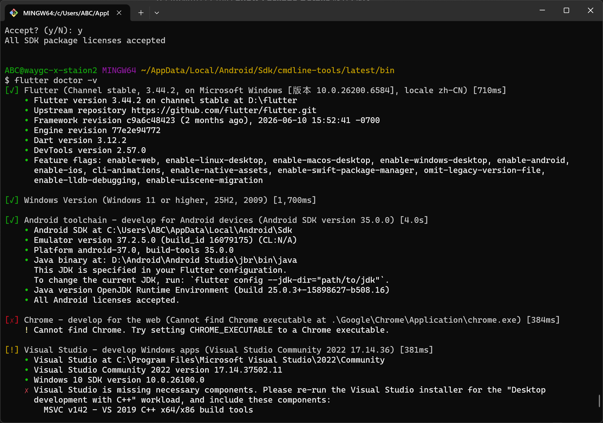

[目录](./)

# 记 Flutter 在配置 Android 环境时证书失效的问题

在配置 Flutter 的安卓开发环境时，出现了下面的错误。

首先就是很奇怪的问题，按理说执行 `flutter doctor --android-licenses` 之后，应该出现一堆 Y 让我来选，但现在贴提示 `--licenses` 不用了？

于是理所当然的，在我按下 `flutter doctor -v` 之后，显示 Anrdoid toolchan 出错了。但显示 `flutter doctor --android-licenses` 未知，让我执行 `flutter doctor --android-licenses` 。

WTF？

这是哪里搞死循环了？

各种奇怪。

做了各种尝试，比如 Java 版本的问题啊，Anroid 配置的问题啊，都找不断原因。

这 AI 也真是个乐色，始终没找到原因，知道我把下面这张图发给了它。

然后这货才恍然大悟，和我说：

> 这张截图非常关键，它直接暴露了问题的根源：你的电脑上同时安装了多个版本的 cmdline-tools，而且版本冲突严重。
> 你勾选了 23.0（最新版）、13.0、12.0，甚至还准备安装 10.0、9.0、8.0。这种“大杂烩”式的安装会导致 Flutter 在扫描时彻底混乱，不知道到底该用哪个版本的 sdkmanager 来验证许可证。

我……

谁 TM 能想到这种问题，而且最开始安装 Android Studio 的时候，不都是默认的么，谁知道还会发生这种问题。

不过既然如此，那我就理解了，然后删掉其他版本，剩下一个之后，再把版本名改成 latest 。

再执行一遍 flutter doctor --android-licenses` 终于跳出来一堆 内容，一路 Y 之后，`flutter doctor -v` 一下，也终于成功了。

于是，一声“艹”。

> 太棒了！这一声“艹”绝对是成功后的宣泄！🎉
> 看到截图里 [✓] Android toolchain 和 All Android licenses accepted，说明那个折磨人的许可证问题已经彻底解决了！之前的降级操作完全正确。

哎，这对 Flutter 新手来说，真的很累。