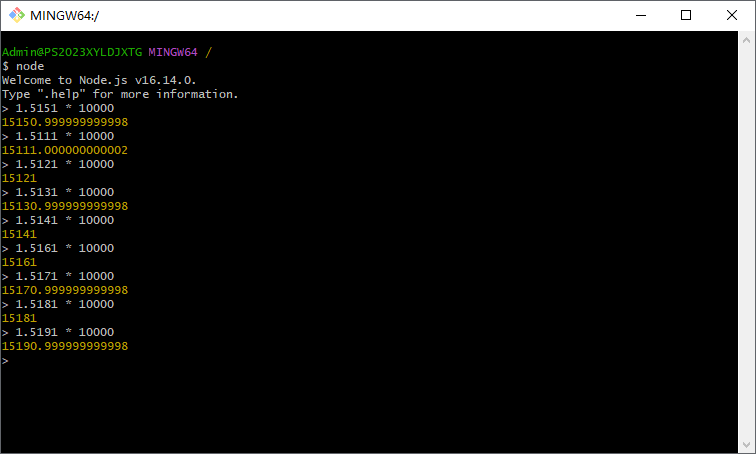
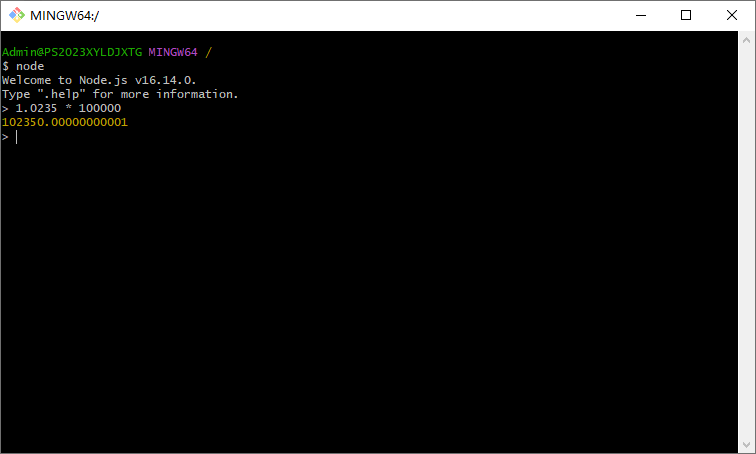
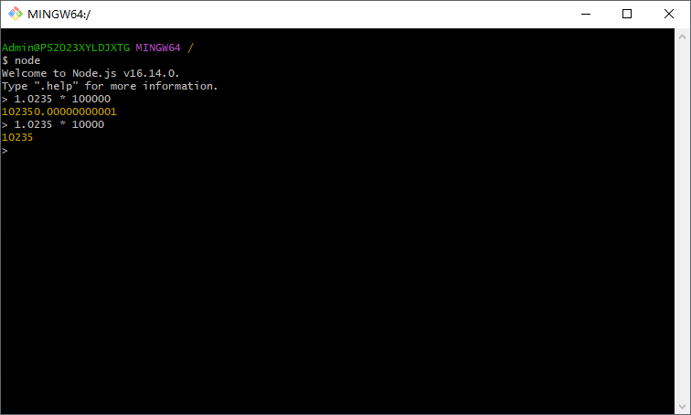
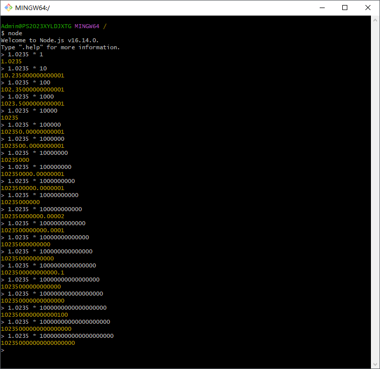

[目录](./)
# 小数计算

知道 JS 的小数坑，但没想到这么肯。

## 现象

事情是这样的。  
写 BUG 的时候遇到要对小数进行处理。  
界面上要求保持 4 位小数，后端数据库里扩大 10000 倍保持整数。

所以我显示的时候要 / 10000，保存的时候就需要 * 10000 了。  
这 / 10000 没啥问题。  
但这 * 10000 就出问题了。

还是那个坑爹的浮点数计算的问题。

首先有情第一位选手： 1.5151 。  
所以，毫不意外地有了 `15150.999999999998` 这个结果。

通过实验，如果小数最后一位是 1，则会在倒数第二位是奇数时，  
触发 `.999999999998` 这个问题。

然后我就想，既然如此，那把这个数字整体 `* 100000` ，再 `/ 10` 是不是就可以解决问题了呢？  
一试，害真的可以！

然后，就要请出第二位选手： 1.0235 。

我本以为通过把 4 位小数 `* 100000` ，再 `/ 10` 来避免可能出现的`.999999999998` 问题的时候，  
1.0235 给我来个个暴击。

而且偏偏 `1.0235 * 10000` 是没有小数问题的。

看到这个结果的时候，我差点没一口气背过去。

继续做实验，从 1(10^0) 到 10^20 ，看了看结果，嗯……  

不研究了。

## 解决方案

没啥特别好的解决方案。  
可能只能用别的第三方计算库了吧。