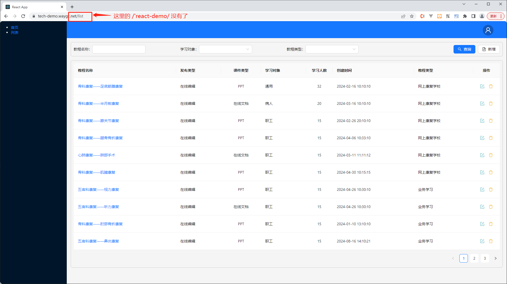
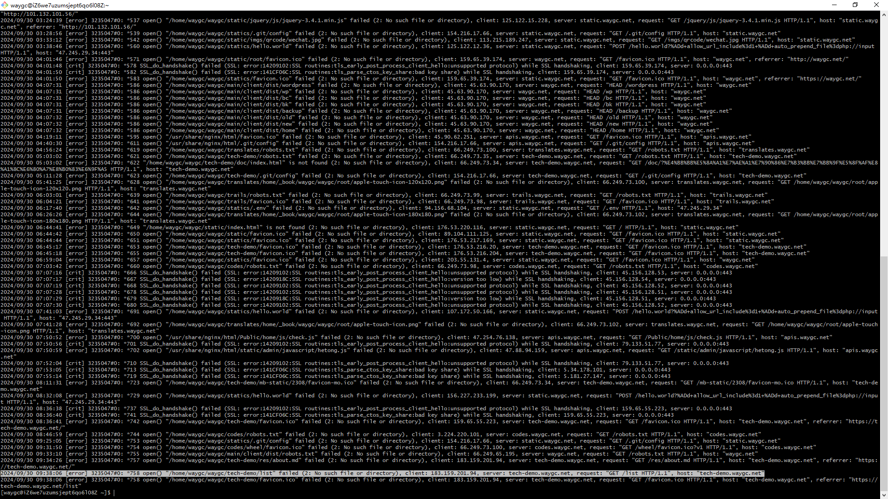
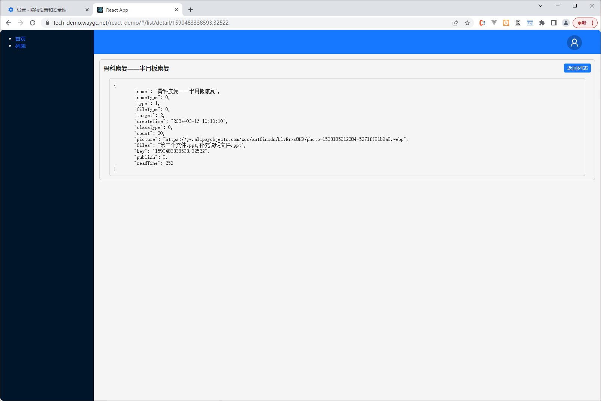

[目录](./)

# React编译到二级目录下时遇到一些坑

事情是这样的，因为个人名下域名太多，所以我准备把 [react-demo.waygc.net](http://react-demo.waygc.net) 这里的东西搬迁到 [tech-demo.waygc.net/react-demo](https://tech-demo.waygc.net/react-demo) 去。

然后说干就干，开始研究怎么把 react 编译到二级目录下。  
一番操作后，发现并不如网上说的往 `package.json` 里加入 `"homepage" : "/react-demo/"` 就可以了这么简单。

下面是我发现的几个坑，需要注意

## 1\. `/react-demo/` 路径不见了。



代码里我是这么写的

```
<Route path="/list" element={<List />}></Route>
```

如果我把代码改成

```
<Route path="/react-demo/list" element={<List />}></Route>
```

就不会出现上面的问题。

## 2\. a 标签失效

加入有如下代码

```
<a href="/list/detail">详细页</a>
```

路由会直接 404 。  
而且翻看 nginx 的日志会发现，这个 list 去请求 nginx 了。  



而 nginx 里没有做任何处理，自然就 404 了。

但问题就是，这如果不配置在二级目录下，就不会有任何问题。

然后把 a 标签改成 Link 就没有问题了。

```
<Link to={`/list/detail/`}>详细页</Link>
```

也就是说，我要访问 `tech-demo.waygc.net/react-demo/list` 这个路由，只能通过首页一层层点进去，而没有办法直接在浏览器里复制地址，直接访问。

看网上的一些说法，好像配置 nginx 之后就可以，但我目前还没找到解决方案。

## 最终解决方案

在设置了无数次 nginx 无果之后，想到了一个点，如果我把 react 的路由改成 hash 模式，是不是就可以了呢？  
看了看原来的代码

```
import {
	BrowserRouter as Router,
	Routes,
	Route,
} from 'react-router-dom';
```

于是把 BrowserRouter 改成 HashRouter 一试，果然就解决了问题～


