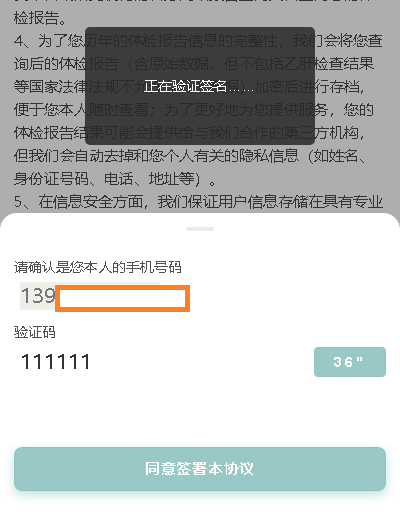

[目录](./)
# Select设置可以清空setState不立刻更新页面的问题

有这么一个需求



如图所示，需要在按下“同意签署本协议”按钮后，立刻弹出“签名验证中的”消息提示。

react 的代码中，那个按钮是这么实现的
```
        <div className={styles.licenseBtnContainer} onClick={this.sign}>
            <div className={[styles.licenseBtn, disableLogin ? styles.disablbtn : ''].join(' ')}>同意签署本协议</div>
        </div>
```

而且页面也已经有了对签名的消息提示
```
        {isAnotherCondition) && ( // isAnotherCondition 这个条件不能随意出发和修改
          <Toast block inline autoClose={false}>
            <div>
              <div style={{ height: '7rem', width: '50vw', lineHeight: '7rem' }}>正在验证签名……</div>
            </div>
          </Toast>
        )}
```

于是，找到绑定的 `sign` 函数。

```
    sign = () => {

        // 前略
        dispatch(signKeywordText(validCode, signPictrue)); // 这里处理的提交
    }
```

于是，我认为修改很简单，只要在 `dispatch` 的前后加上 对 `state` 的状态修改就可以了。

代码修改完毕后：
```
        {this.state.isEncoding || isAnotherCondition) && (
          <Toast block inline autoClose={false}>
            <div>
              <div style={{ height: '7rem', width: '50vw', lineHeight: '7rem' }}>正在验证签名……</div>
            </div>
          </Toast>
        )}

        // ... 中略

        sign = () => {

            // 前略
            this.setState({"isEncoding": true});
            dispatch(signKeywordText(validCode, signPictrue)); // 这里处理的提交
            this.setState({"isEncoding": false});
        }
```

但实际上却不行。  
`setState` 的动作是执行了，我也在控制台中看到了 `state.isEncoding` 的值确实改变了。

但是！

页面没有任何变化，没有弹出“签名验证中的”的消息提示。  
肯定是哪里改错了……

一番查找之后发现，原来 `setState` 得加一个回调函数才行……

```
            this.setState({encoding: true},() => {
                dispatch(signKeywordText(code, handleScript))
                    .then(e => {
                        this.setState({encoding: false});
                    })
                    .catch (e => {
                        this.setState({encoding: false});
                    });
            });
```

如此一番修改之后，终于 OK 了。

万事大吉。  
收工回家~

参考：[https://blog.csdn.net/handsomexiaominge/article/details/86348235](https://blog.csdn.net/handsomexiaominge/article/details/86348235)