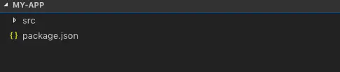

[目录](./)
# 新建一个 react 项目

## 1. 初始化项目

首先第一步我们先创建一个名字是my-app的文件夹
```
mkdir my-app
```
进入该目录
```
cd my-app
```

然后在my-app目录下创建src文件夹用来存放React代码
```
mkdir src
```

使用npm命令初始化项目
```
npm init -y
```

此时的项目结构如下  



## 2. 安装webpack

首先安装webpack和webpack-cli,webpack-cli包含了webpack的众多指令，所以需要安装。  
npm install webpack webpack-cli --save-dev

注意： 在这里简单介绍一下npm install命令的参数 --save-dev 和 --save的区别，一般来说使用--save-dev参数安装的npm包在最终打包的时候不会被包括到源码里去，所以类似bebel和webpack这种进行项目工程构建或者代码编译的库应该用--save-dev来安装，而--save则是安装代码运行必须的库，比如react等。

## 3. 安装Babel

进行前端工程化的时候大多数前端工程师都会用到babel,最开始的babel是用来把es6的代码编译成es5的代码，让前端开发者在使用新的特性的同时不必考虑浏览器兼容问题。虽然现在的主流浏览器已经支持大部分的es6的新特性，但是因为JavaScript每年都会有一些新的特性被提出，而浏览器不一定能在特性推出后及时实现，或者是有一些还在实验中的语法。使用来babel后就可以忽略这些问题，可以放心使用新的JavaScript语法，甚至是实验性的语法。

接下来我们会安装这几个包：

* @babel/core
* @babel/preset-env
* @babel/preset-react
* babel-loader

很明显@babel/core是babel的核心库，必须安装，@babel/preset-env帮助我们把es6的语法编译成es5的语法，@babel/preset-react则是帮我们识别JSX语法，babel-loader则是帮我们把不同的文件转化成我们想要的格式输出，或者说就是将我们的经过babel处理后的代码进行输出成浏览器可以识别的文件。

安装指令
```
npm install @babel/core babel-loader @babel/preset-env @babel/preset-react --save-dev
```

在安装成功后必须进行babel的配置，在根目录my-app建立.babelrc文件，然后写入以下配置
```
{
  "presets": ["@babel/preset-env", "@babel/preset-react"]
}
```

然后我们需要做一些webpack的配置，在根目录my-app建立webpack.config.js文件，然后写入以下配置
```
const path = require('path');

module.exports = {
  entry: './src/main.js',
  output: {
    filename: 'bundle.js',
    path: path.resolve(__dirname, 'dist')
  },
  module: {
    rules: [
      {
        test: /\.js$/,
        exclude: /node_modules/,
        use: {
          loader: "babel-loader"
        }
      }
    ]
  }
};
```

在babel配置完之后，我们需要在./src目录下新建三个文件index.html、main.js、App.js,此时我们的项目的所有文件都创建完毕，项目结构应该如下所示：  


接下来因为webpack默认只能对.js文件进行最终打包，而我们的项目是有.html文件的，所以我们必须下载和html有关的loader和插件来对html进行处理。

## 4. 处理html

安装html-webpack-plugin和html-loader
```
npm install html-webpack-plugin html-loader --save-dev
```

在安装完成之后我们需要在webpack.config.js中进行配置
```
webpack.config.js文件内容如下
const path = require('path');
const HtmlWebPackPlugin = require("html-webpack-plugin");
module.exports = {
  entry: './src/main.js',
  output: {
    filename: 'bundle.js',
    path: path.resolve(__dirname, 'dist')
  },
  module: {
    rules: [
      {
        test: /\.js$/,
        exclude: /node_modules/,
        use: {
          loader: 'babel-loader'
        }
      },
      {
        test: /\.html$/,
        use: {
          loader: 'html-loader'
        }
      }
    ]
  },
  plugins: [
    new HtmlWebPackPlugin({
      titel: 'react app',
      filename: 'index.html',
      template: './src/index.html'
    })
  ]
};
```

配置完成后我们开始写react代码，首先在index.html文件中写入以下代码(在一个基本.html页面中加一个id是app的div)
```
<!DOCTYPE html>
<html lang="en">
<head>
  <meta charset="UTF-8">
  <meta name="viewport" content="width=device-width, initial-scale=1.0">
  <meta http-equiv="X-UA-Compatible" content="ie=edge">
  <title>React</title>
</head>
<body>
  <div id="app"></div>
</body>
</html>
```

然后在写react代码前需要安装react和react-dom
```
npm install react react-dom --save
```

在App.js文件中创建一个组件并导出
```
import React from 'react'

class App extends React.Component {
  render() {
    return(
      <div>
        <h1>Hello World</h1>
      </div>
    )
  }
}

export  default App
```

在main.js中将组件导入并渲染
```
import React from 'react'
import ReactDOM from 'react-dom'
import App from './App.js'

ReactDOM.render(<App/>, document.getElementById('app'))
```

## 5. 运行项目

所有的代码已经完毕，在运行前我们还要安装webpack-dev-server用来启动一个本地服务器来浏览我们的项目并且可以实现保存自动刷新
```
npm install webpack-dev-server --save-dev
```

然后在根目录的package.json中写一个脚本
```
"scripts": {
    "start": "webpack-dev-server --open --mode development"
}
```

最后运行npm run start就可以在浏览器中看到Hello World了
```
npm run start
```

参考：[https://www.jianshu.com/p/68e849768d8e](https://www.jianshu.com/p/68e849768d8e)
