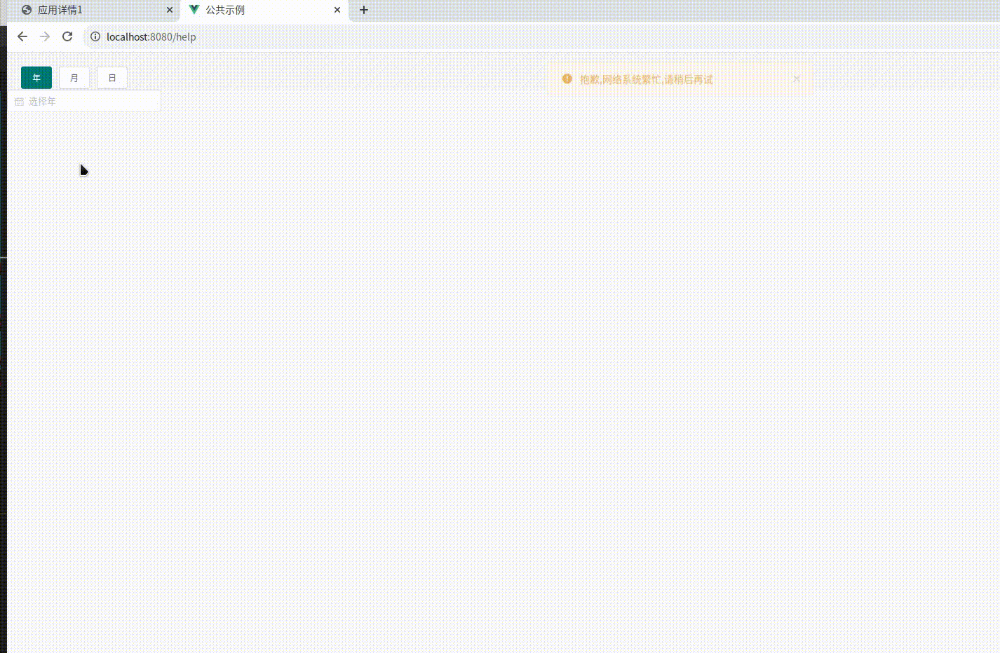

[目录](./)
# ElementUI日期组件用v-if显示时，样式出错

### 现象


### 代码
```
<template>
  <div v-loading="inLoading" element-loading-tex="数据加载中...">
    <div class="page-search">
      <el-button :type="btnType.year" @click="changeType('year')">年</el-button>
      <el-button :type="btnType.month" @click="changeType('month')">月</el-button>
      <el-button :type="btnType.date" @click="changeType('date')">日</el-button>
    </div>
    <div v-if="searchForm.type === 'year'">
    <div class="container">
        <div class="block">
            <el-date-picker
              v-model="searchForm.year"
              type="year"
              placeholder="选择年">
            </el-date-picker>
          </div>
      </div>
    </div>
    <div v-if="searchForm.type === 'month'">
    <div class="container">
      <div class="block">
        <el-date-picker
          v-model="searchForm.month"
          type="monthrange"
          range-separator="至"
          start-placeholder="开始月"
          end-placeholder="结束月"
        ></el-date-picker>
      </div>
    </div>
    </div>
    <div v-if="searchForm.type === 'date'">
    <div class="container">
      <div class="block">
        <el-date-picker
          v-model="searchForm.date"
          type="daterange"
          range-separator="至"
          start-placeholder="开始日"
          end-placeholder="结束日"
        ></el-date-picker>
      </div>
    </div>
  </div>
    </div>
</template>
<script>
export default {
  data () {
    return {
      searchForm: {
      type: 'year'
      },
      btnType: {
        year: 'primary',
        month: '',
        date: ''
      }
    }
  },
  methods: {
    changeType (name) {
      for (let k in this.btnType) {
        if (k === name) {
          this.btnType[k] = 'primary'
        } else {
          this.btnType[k] = ''
        }
      }
      this.searchForm.type = name
    }
  }
}
</script>
```

### 解决方案

参考资料：[https://www.php.cn/js-tutorial-453052.html](https://www.php.cn/js-tutorial-453052.html)

修改了一下代码

```
<template>
  <div v-loading="inLoading" element-loading-tex="数据加载中...">
    <div class="page-search">
      <el-button :type="btnType.year" @click="changeType('year')">年</el-button>
      <el-button :type="btnType.month" @click="changeType('month')">月</el-button>
      <el-button :type="btnType.date" @click="changeType('date')">日</el-button>
    </div>
    <div v-if="renderComponent.year">
    <div class="container">
        <div class="block">
            <el-date-picker
              v-model="searchForm.year"
              type="year"
              placeholder="选择年">
            </el-date-picker>
          </div>
      </div>
    </div>
    <div v-if="renderComponent.month">
    <div class="container">
      <div class="block">
        <el-date-picker
          v-model="searchForm.month"
          type="monthrange"
          range-separator="至"
          start-placeholder="开始月"
          end-placeholder="结束月"
        ></el-date-picker>
      </div>
    </div>
    </div>
    <div v-if="renderComponent.date">
    <div class="container">
      <div class="block">
        <el-date-picker
          v-model="searchForm.date"
          type="daterange"
          range-separator="至"
          start-placeholder="开始日"
          end-placeholder="结束日"
        ></el-date-picker>
      </div>
    </div>
  </div>
    </div>
</template>
<script>
export default {
  data () {
    return {
      renderComponent : {
        year: true,
        month: false,
        date: false
      },
      searchForm: {
        year: '',
        month: '',
        date: ''
      },
      btnType: {
        year: 'primary',
        month: '',
        date: ''
      }
    }
  },
  methods: {
    changeType (name) {
      for (let k in this.btnType) {
        this.renderComponent[k] = false
        if (k === name) {
          this.btnType[k] = 'primary'
        } else {
          this.btnType[k] = ''
        }
      }

      this.$nextTick().then(() => {
        this.renderComponent[name] = true
      })
    }
  }
}
</script>
```
于是就好了～
