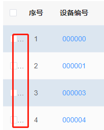
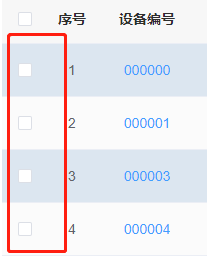
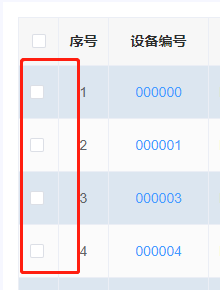

[目录](./)
# el-table-column type=selection 出现三个点的问题

## 现象
el-table 如下配置，就会出现三个点。
```
  <el-table :data="list" :height="height ? height: undefined" style="width: 100%" @selection-change="handleSelectionChange"
    :header-cell-style="{ background: '#F7F7F7', color: '#2d2d2d', 'text-align': 'center' }">
    <el-table-column type="selection" width="40" align="center" fixed="left"></el-table-column>
```


## 解决方案

从网上查到的资料来看，好像是说
```
<el-table-column type="selection" width="40" align="center" fixed="left"></el-table-column>
```
这里的宽度不够，改成如下就可以了
```
<el-table-column type="selection" width="45" align="center" fixed="left"></el-table-column>
```


## 问题

表面是解决了，但是为什么会有三个点，还没有解决，  
通过浏览器分析元素，也每找到三个点来自哪里，以及  
如果 `el-table` 有 `border` 设置，也不会出现三个点

```
  <el-table :data="list" :height="height ? height: undefined" style="width: 100%" @selection-change="handleSelectionChange"
    border
    :header-cell-style="{ background: '#F7F7F7', color: '#2d2d2d', 'text-align': 'center' }">
    <el-table-column type="selection" width="40" align="center" fixed="left"></el-table-column>
```
