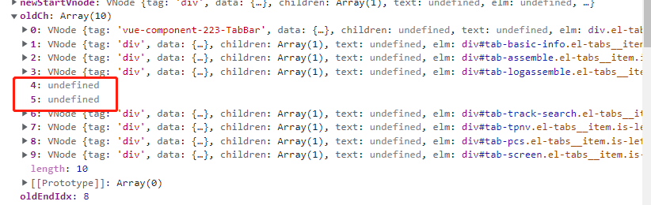

[目录](./)
# tabs中v-if的判断出现一个奇怪的顺序问题

## 现象

有如下代码

```
        <el-tabs v-if="!loading" class="device-detail-tabs" tab-position="left" :style="`height:${height - 30}px;`" v-model="tabName"
          @tab-click="onTabClick"
          :before-leave="beforeLeave"
        >
          <el-tab-pane name="basic-info" label="设备信息" style="height: 100%">
            <basic-info v-if="tabName === 'basic-info'" ref="basic" :is-admin="isAdminUser" :mode="isAdminRoute ? 'admin': 'list'"
              :device-info="deviceInfo" :is-small-screen="isSmallScreen" @upgrade="onUpgradeFirmware" @debug="onDebugMode" />
          </el-tab-pane>
          <el-tab-pane v-if="deviceInfo.projectType !== 1 && deviceInfo.projectType !== 6" name="single" label="电压温度" style="height: 100%">
            <single v-if="tabName === 'single'" ref="single" :device-info="deviceInfo" :is-small-screen="isSmallScreen" />
          </el-tab-pane>
          <el-tab-pane v-if="deviceInfo.projectType === 1 || this.deviceInfo.projectType === 6" name="assemble" label="电压温度" style="height: 100%">
            <assemble v-if="tabName === 'assemble'" ref="assemble" :device-info="deviceInfo" :is-small-screen="isSmallScreen" />
          </el-tab-pane>
          <el-tab-pane v-if="deviceInfo.projectType !== 1 && this.deviceInfo.projectType !== 6" name="device-alarm" label="设备告警" style="height: 100%">
            <device-alarm v-if="tabName === 'device-alarm'" ref="alarm" :device-info="deviceInfo" :is-small-screen="isSmallScreen" />
          </el-tab-pane>
          <el-tab-pane v-if="deviceInfo.projectType === 1 || this.deviceInfo.projectType === 6" name="logassemble" label="总控数据" style="height: 100%">
            <logassemble v-if="tabName === 'logassemble'" :device-info="deviceInfo" :is-small-screen="isSmallScreen" />
          </el-tab-pane>
          <el-tab-pane v-if="deviceInfo.projectType === 0" name="electricitybill" label="充放电价" style="height: 100%">
            <electricity-bill v-if="tabName === 'electricitybill'" ref="electricitybill" :device-info="deviceInfo" :is-small-screen="isSmallScreen" />
          </el-tab-pane>
          <el-tab-pane v-if="deviceInfo.projectType === 1 || this.deviceInfo.projectType === 6" name="chg-dischg-report" label="充放报表" style="height: 100%">
            <chg-dischg-report v-if="tabName === 'chg-dischg-report'" :device-info="deviceInfo" :is-small-screen="isSmallScreen" />
          </el-tab-pane>
          <el-tab-pane name="history-data" label="历史数据" style="height: 100%">
            <history-data v-if="tabName === 'history-data'" ref="history" :device-info="deviceInfo" :is-small-screen="isSmallScreen" />
          </el-tab-pane>
          <el-tab-pane name="track-search" label="设备轨迹" style="height: 100%">
            <track-search v-if="tabName === 'track-search'" ref="track" :device-info="deviceInfo" :is-small-screen="isSmallScreen" box-height="calc(100% - 120px);" />
          </el-tab-pane>
          <el-tab-pane name="tpnv" label="尖峰平谷" style="height: 100%">
            <tpnv v-if="tabName === 'tpnv'" ref="tpnv" :device-info="deviceInfo" :is-small-screen="isSmallScreen" box-height="calc(100% - 120px);" />
          </el-tab-pane>
          <el-tab-pane name="screen" label="数据大屏" style="height: 100%"></el-tab-pane>
          <el-tab-pane name="configs" label="参数配置" style="height: 100%" v-if="isAdminRoute && isAdminUser">
            <configs v-if="tabName === 'configs'" ref="configs" :device-info="deviceInfo" :is-small-screen="isSmallScreen" />
          </el-tab-pane>
        </el-tabs>
```

因为要加入一个 PCS 数据，所以把代码修改成了下面的样子

```
        <el-tabs v-if="!loading" class="device-detail-tabs" tab-position="left" :style="`height:${height - 30}px;`" v-model="tabName"
          @tab-click="onTabClick"
          :before-leave="beforeLeave"
        >
          <el-tab-pane name="basic-info" label="设备信息" style="height: 100%">
            <basic-info v-if="tabName === 'basic-info'" ref="basic" :is-admin="isAdminUser" :mode="isAdminRoute ? 'admin': 'list'"
              :device-info="deviceInfo" :is-small-screen="isSmallScreen" @upgrade="onUpgradeFirmware" @debug="onDebugMode" />
          </el-tab-pane>
          <el-tab-pane v-if="deviceInfo.projectType !== 1 && deviceInfo.projectType !== 6" name="single" label="电压温度" style="height: 100%">
            <single v-if="tabName === 'single'" ref="single" :device-info="deviceInfo" :is-small-screen="isSmallScreen" />
          </el-tab-pane>
          <el-tab-pane v-if="deviceInfo.projectType === 1 || this.deviceInfo.projectType === 6" name="assemble" label="电压温度" style="height: 100%">
            <assemble v-if="tabName === 'assemble'" ref="assemble" :device-info="deviceInfo" :is-small-screen="isSmallScreen" />
          </el-tab-pane>
          <el-tab-pane v-if="deviceInfo.projectType !== 1 && this.deviceInfo.projectType !== 6" name="device-alarm" label="设备告警" style="height: 100%">
            <device-alarm v-if="tabName === 'device-alarm'" ref="alarm" :device-info="deviceInfo" :is-small-screen="isSmallScreen" />
          </el-tab-pane>
          <el-tab-pane v-if="deviceInfo.projectType === 1 || this.deviceInfo.projectType === 6" name="logassemble" label="总控数据" style="height: 100%">
            <logassemble v-if="tabName === 'logassemble'" :device-info="deviceInfo" :is-small-screen="isSmallScreen" />
          </el-tab-pane>
          <el-tab-pane v-if="deviceInfo.projectType === 0" name="electricitybill" label="充放电价" style="height: 100%">
            <electricity-bill v-if="tabName === 'electricitybill'" ref="electricitybill" :device-info="deviceInfo" :is-small-screen="isSmallScreen" />
          </el-tab-pane>
          <el-tab-pane v-if="deviceInfo.projectType === 1 || this.deviceInfo.projectType === 6" name="chg-dischg-report" label="充放报表" style="height: 100%">
            <chg-dischg-report v-if="tabName === 'chg-dischg-report'" :device-info="deviceInfo" :is-small-screen="isSmallScreen" />
          </el-tab-pane>
          <el-tab-pane name="history-data" label="历史数据" style="height: 100%">
            <history-data v-if="tabName === 'history-data'" ref="history" :device-info="deviceInfo" :is-small-screen="isSmallScreen" />
          </el-tab-pane>
          <el-tab-pane name="track-search" label="设备轨迹" style="height: 100%">
            <track-search v-if="tabName === 'track-search'" ref="track" :device-info="deviceInfo" :is-small-screen="isSmallScreen" box-height="calc(100% - 120px);" />
          </el-tab-pane>
          <el-tab-pane name="tpnv" label="尖峰平谷" style="height: 100%">
            <tpnv v-if="tabName === 'tpnv'" ref="tpnv" :device-info="deviceInfo" :is-small-screen="isSmallScreen" box-height="calc(100% - 120px);" />
          </el-tab-pane>
          <!-- PCS 数据为新加入的内容 -->
          <el-tab-pane name="pcs" label="PCS 数据" style="height: 100%" v-if="deviceInfo.projectType === 1 || this.deviceInfo.projectType === 6">
            <pcs v-if="tabName === 'pcs'" ref="pcs" :device-info="deviceInfo" :is-small-screen="isSmallScreen" />
          </el-tab-pane>
          <el-tab-pane name="screen" label="数据大屏" style="height: 100%"></el-tab-pane>
          <el-tab-pane name="configs" label="参数配置" style="height: 100%" v-if="isAdminRoute && isAdminUser">
            <configs v-if="tabName === 'configs'" ref="configs" :device-info="deviceInfo" :is-small-screen="isSmallScreen" />
          </el-tab-pane>
        </el-tabs>
```

然后，测试的时候发生了一个很奇怪的为问题

```
vue.runtime.esm.js:3065 TypeError: Cannot read properties of undefined (reading 'key')
    at sameVnode (vue.runtime.esm.js:6466:1)
    at updateChildren (vue.runtime.esm.js:6844:1)
    at patchVnode (vue.runtime.esm.js:6933:1)
    at updateChildren (vue.runtime.esm.js:6807:1)
    at patchVnode (vue.runtime.esm.js:6933:1)
    at updateChildren (vue.runtime.esm.js:6807:1)
    at patchVnode (vue.runtime.esm.js:6933:1)
    at VueComponent.patch [as __patch__] (vue.runtime.esm.js:7101:1)
    at Vue._update (vue.runtime.esm.js:3785:1)
    at VueComponent.updateComponent (vue.runtime.esm.js:3891:1)
```

而且这个错误是发生在一个八竿子打不着的地方……  
嗯，硬要说打也打的着，因为那个操作后，会有影响 `deviceInfo.projectType` 的判断的地方，所以上面的 tabs 里的数据会有变化。

## 思考

调用堆栈的时候发现是因为 VNode 出现了两个 `undefined` 。  


也不知道是 ElementUI 的问题，还是 Vue 的问题。  
估计  ElementUI 的问题的可能性更大一些。

但因为想不通这里的 tab 为什么会有两个 `undefined` ，所以暂时也没啥想法。

## 解决方案
最后发现，去掉新加入的`PCS 数据`就没问题，那把这个`PCS 数据`换个地方呢？

于是把代码改成下面这个样子

```
        <el-tabs v-if="!loading" class="device-detail-tabs" tab-position="left" :style="`height:${height - 30}px;`" v-model="tabName"
          @tab-click="onTabClick"
          :before-leave="beforeLeave"
        >
          <el-tab-pane name="basic-info" label="设备信息" style="height: 100%">
            <basic-info v-if="tabName === 'basic-info'" ref="basic" :is-admin="isAdminUser" :mode="isAdminRoute ? 'admin': 'list'"
              :device-info="deviceInfo" :is-small-screen="isSmallScreen" @upgrade="onUpgradeFirmware" @debug="onDebugMode" />
          </el-tab-pane>
          <el-tab-pane v-if="deviceInfo.projectType !== 1 && deviceInfo.projectType !== 6" name="single" label="电压温度" style="height: 100%">
            <single v-if="tabName === 'single'" ref="single" :device-info="deviceInfo" :is-small-screen="isSmallScreen" />
          </el-tab-pane>
          <el-tab-pane v-if="deviceInfo.projectType === 1 || this.deviceInfo.projectType === 6" name="assemble" label="电压温度" style="height: 100%">
            <assemble v-if="tabName === 'assemble'" ref="assemble" :device-info="deviceInfo" :is-small-screen="isSmallScreen" />
          </el-tab-pane>
          <el-tab-pane v-if="deviceInfo.projectType !== 1 && this.deviceInfo.projectType !== 6" name="device-alarm" label="设备告警" style="height: 100%">
            <device-alarm v-if="tabName === 'device-alarm'" ref="alarm" :device-info="deviceInfo" :is-small-screen="isSmallScreen" />
          </el-tab-pane>
          <el-tab-pane v-if="deviceInfo.projectType === 1 || this.deviceInfo.projectType === 6" name="logassemble" label="总控数据" style="height: 100%">
            <logassemble v-if="tabName === 'logassemble'" :device-info="deviceInfo" :is-small-screen="isSmallScreen" />
          </el-tab-pane>
          <el-tab-pane v-if="deviceInfo.projectType === 0" name="electricitybill" label="充放电价" style="height: 100%">
            <electricity-bill v-if="tabName === 'electricitybill'" ref="electricitybill" :device-info="deviceInfo" :is-small-screen="isSmallScreen" />
          </el-tab-pane>
          <el-tab-pane v-if="deviceInfo.projectType === 1 || this.deviceInfo.projectType === 6" name="chg-dischg-report" label="充放报表" style="height: 100%">
            <chg-dischg-report v-if="tabName === 'chg-dischg-report'" :device-info="deviceInfo" :is-small-screen="isSmallScreen" />
          </el-tab-pane>
          <!-- PCS 数据修改到了这里 -->
          <el-tab-pane name="pcs" label="PCS 数据" style="height: 100%" v-if="deviceInfo.projectType === 1 || this.deviceInfo.projectType === 6">
            <pcs v-if="tabName === 'pcs'" ref="pcs" :device-info="deviceInfo" :is-small-screen="isSmallScreen" />
          </el-tab-pane>
          <el-tab-pane name="history-data" label="历史数据" style="height: 100%">
            <history-data v-if="tabName === 'history-data'" ref="history" :device-info="deviceInfo" :is-small-screen="isSmallScreen" />
          </el-tab-pane>
          <el-tab-pane name="track-search" label="设备轨迹" style="height: 100%">
            <track-search v-if="tabName === 'track-search'" ref="track" :device-info="deviceInfo" :is-small-screen="isSmallScreen" box-height="calc(100% - 120px);" />
          </el-tab-pane>
          <el-tab-pane name="tpnv" label="尖峰平谷" style="height: 100%">
            <tpnv v-if="tabName === 'tpnv'" ref="tpnv" :device-info="deviceInfo" :is-small-screen="isSmallScreen" box-height="calc(100% - 120px);" />
          </el-tab-pane>
          <el-tab-pane name="screen" label="数据大屏" style="height: 100%"></el-tab-pane>
          <el-tab-pane name="configs" label="参数配置" style="height: 100%" v-if="isAdminRoute && isAdminUser">
            <configs v-if="tabName === 'configs'" ref="configs" :device-info="deviceInfo" :is-small-screen="isSmallScreen" />
          </el-tab-pane>
        </el-tabs>
```

然后就好了……  
好了……  
了……

原因未知。
