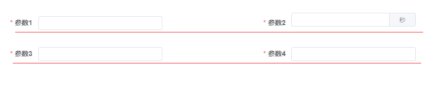
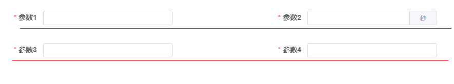

[目录](./)
# 带 append 的 input 输入框的横向对齐的问题

elementui 的 el-input 如果带有 apeend，也就是下面的代码
```
<el-form-item label="参数2" prop="param2">
	<el-input v-model="form.param2" size="mini">
		<template #append>秒</template>
	</el-input>
</el-form-item>
```

在 UI 上显示的时候，横向对齐会有一定的偏差，效果见下图。



原因是这里的默认设置是

```
.el-input-group {
  vertical-align: top;
}
```

所以这时候，加上下面的 CSS 设置就可以解决这个偏差问题。

```
.el-input-group {
  vertical-align: middle !important;
}
```
，效果见下图。


