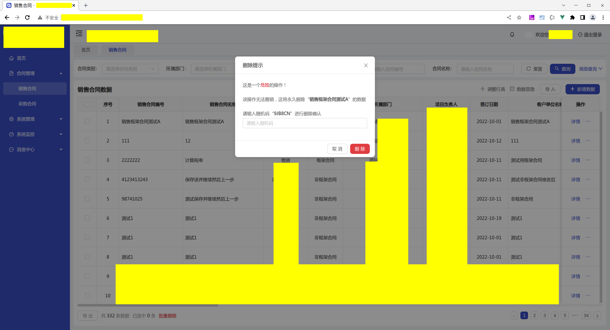

[目录](./)
# DeleteWarningModal

## 说明
这个 modal 用于修改敏感信息时的二次密码验证

## 代码
```
<template>
    <a-modal
    title="删除提示"
    :width="440"
    :visible="visible"
    @cancel="handleCancel"
  >
    <a-form-model ref="form" :model="editForm" :rules="validatorRules">

      <div>这是一个<span style="color:#D31723; font-weight: 600;">危险</span>的操作！</div>
      <div style=" margin-bottom:24px;  margin-top:24px;">该操作无法撤销，这将永久删除“<b>{{delObjName}}</b>”的{{others}}数据</div>

      <div>请输入随机码“<b>{{randCode}}</b>”进行删除确认</div>
      
      <a-form-model-item prop="inputRandCode" >
        <a-input placeholder="请输入随机码" v-model="editForm.inputRandCode" />
      </a-form-model-item>

    </a-form-model>

    <template #footer>
      <a-button @click="handleCancel" type="ghost">取消</a-button>
      <a-button @click="handleSubmit" style="color:#FFFFFF; background:#E03D42!important;">删除</a-button>
    </template>
  </a-modal>
</template>
<script>
  const BASE_STR = "23456789ABCDEFGHJKLMNPQRSTUVWXYZ";

  export default {
    name: "ValiPasswordModal",
    data () {
      return {
        visible: false,
        callback: null,
        delObjName: "",
        others: "",
        randCode: "",
        editForm: {
            inputRandCode: ""
        },
        validatorRules: {
          inputRandCode: [
            { required: true, message: '请输入随机码' },
            { validator: this.validInputRandCode }
          ]
        }
      };
    },
    methods: {
      handleSubmit () {
        this.$refs.form.validate(valid => {
          if (!valid) {
            return;
          }
          this.close();
          setTimeout(() => { // 稍作延迟，可以上视觉上有所察觉
            this.callback();
          }, 500);
        });
      },
      show (delObjName, others, callback) {
        this.editForm = {};
        this.delObjName = delObjName;
        if (others) {
          this.others = others.join("、");
          if (others.length > 1) {
            this.others += "等";
          }
        }
        this.visible = true;
        this.callback = callback;
        let code = [];
        for (let i = 0; i < 6; i++) {
          let index = Math.trunc(Math.random() * BASE_STR.length);
          if (index >= BASE_STR.length) {
            index = BASE_STR.length - 2;
          }
          code[i] = BASE_STR[index];
        }
        this.randCode = code.join("");
      },
      handleCancel () {
        this.close();
      },
      close() {
        this.$emit('close');
        this.visible = false;
      },
      validInputRandCode (rule, value, callback) {
        if (this.editForm.inputRandCode !== this.randCode) {
          callback("输入的随机码错误");
        } else {
          callback();
        }
      }
    }
  }
</script>
```

## 示例


