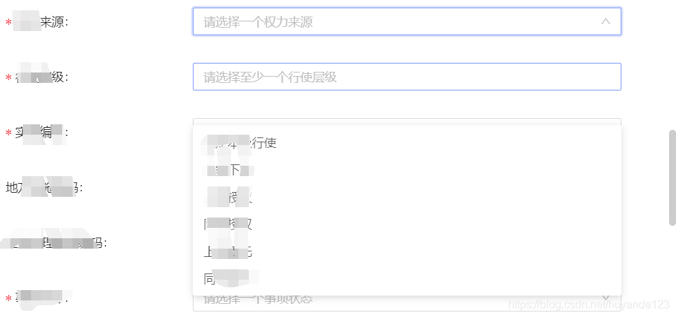

[目录](./)
# a-select组件下拉列表在局部滚动时不跟随的问题

## 现象



## 解决方案

在 <a-select> 的定义中加入如下片段：
```
              :getPopupContainer="
                triggerNode => {
                  return triggerNode.parentNode || document.body;
                }"
```

### 示例

```
 <a-select
              :getPopupContainer="
                triggerNode => {
                  return triggerNode.parentNode || document.body;
                }"
              style="width: 100%"
              :dropdownStyle="{ maxHeight: '400px', overflow: 'auto' }"
              :treeData="treeData"
              placeholder="请选择行使主体!"
              treeDefaultExpandAll
              v-decorator="['deptCode',{ rules: [{ required: true, message: '请选择行使主体!' }] },]"
            >
```