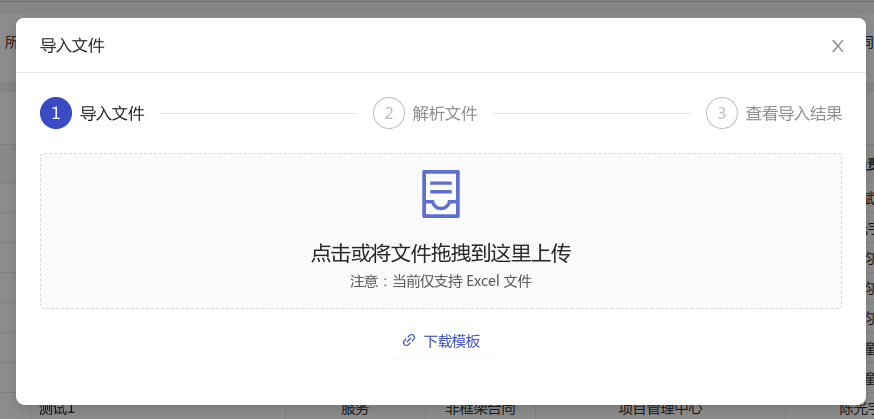
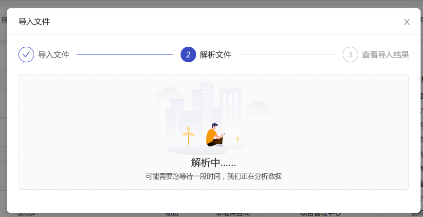
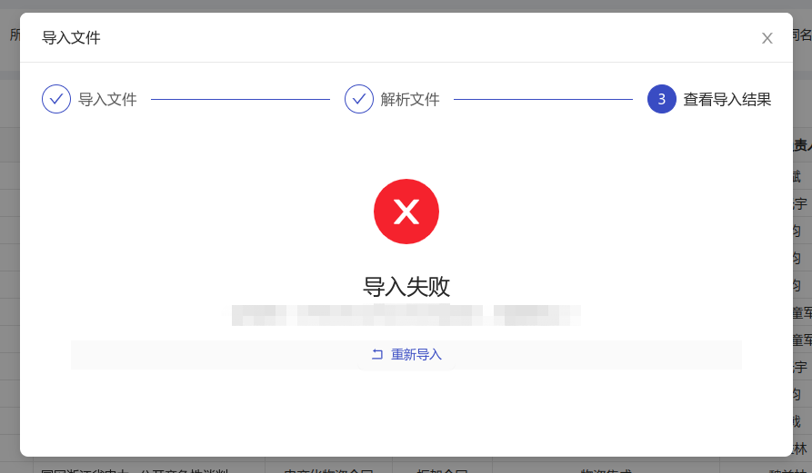

[目录](./)
# UploadModal

## 代码

```
<template>
  <a-modal
    :title="'导入文件'"
    :width="850"
    :visible="visible"
    @ok="handleClose"
    @cancel="handleClose"
		:footer="null"
  >

    <a-steps :current="step">
      <a-step title="导入文件" />
      <a-step title="解析文件" />
      <a-step title="查看导入结果" />
    </a-steps>
    <div style="margin:24px 0px;">
      <a-upload-dragger
        v-if="step !== 2"
        :headers="tokenHeader"
        name="file"
        :multiple="false"
        :show-upload-list="false"
        :before-upload="beforeUpload"
        :action="importExcelUrl"
        @change="handleChange"
      >
        <div v-if="step === 0">
          <div>
            <p class="ant-upload-drag-icon">
              <a-icon type="container" />
            </p>
            <p class="ant-upload-text">点击或将文件拖拽到这里上传</p>
            <p class="ant-upload-hint">注意：当前仅支持 Excel 文件</p>
          </div>
        </div>
        <div v-if="step === 1">
          <div class="upload_step_box">
            
            <p class="ant-upload-text">解析中……</p>
            <p class="ant-upload-hint">可能需要您等待一段时间，我们正在分析数据</p>
          </div>
        </div>
      </a-upload-dragger>
      <div v-if="step === 2">
        <div class="upload_step_box">
          <a-result
            :status="uploadResultStatus"
            :title="'导入' + uploadResultVal"
            :sub-title="uploadResultMessage"
          >
            <template>
              <div v-if="step === 2 && uploadResultStatus === 'error'" class="upload_down_template">
                <a-button type="text" icon="rollback" @click="reImport">重新导入</a-button>
              </div>
            </template>
          </a-result>
        </div>
      </div>
      <div v-if="step === 0" class="upload_down_template">
        <a-button type="text" icon="link" @click="downloadTemplate">下载模板</a-button>
      </div>
    </div>
  </a-modal>
</template>
<script>
import { downFile } from '@/api/manage';

  export default {
    props: {
      importUrl: {
        type: String,
        default: ""
      },
      dlTemplateUrl: {
        type: String,
        default: ""
      },
      tokenHeader: {
        type: Object,
        default: {}
      },
      type: {
        type: String,
        default: ""
      }
    },
    data () {
      return {
        canUpload: false,
        step: 1,
        visible: false,
		fileList: [],
        uploadResultStatus: '',
        uploadResultVal: '',
        uploadMessage: '',
        timeoput: null
      }
    },
    computed: {
      importExcelUrl: function(){
        return `${window._CONFIG['domianURL']}${this.importUrl}`;
      }
    },
    methods: {
      show () {
        this.step = 0;
        this.visible = true;
      },
      handleClose () {
        this.step = 0;
        this.visible = false;
        this.$emit("close");
      },
      handleChange (evt) {
        const file = evt.file;
        if (!file.status) {
          return;
        }
        // this.$emit("upload", evt, () => {
          if (evt.file.status === 'uploading') {
            this.step = 1;
            this.timeoput = setTimeout(() => {
              if (this.uploadResultStatus !== 'uploading') {
                return;
              }
              this.uploadToStep2({
                status: 'error',
                message: '导入超时，请稍后再试'
              });
            }, 5000);
          } else {
            this.uploadToStep2(evt.file);
          }
        // });
      },
      uploadToStep2 (file) {
        const {status, response} = file;
        if (status === 'removed') {
          return;
        }
        this.step = 2;

        if (response.status === "success" && response.success) {
          this.uploadResultVal = '成功';
          this.uploadResultStatus = "success";
        } else {
          this.uploadResultVal = '失败';
        this.uploadResultStatus = "error";
        }
        this.uploadResultMessage = response.message;
        clearTimeout(this.timeoput);
        this.timeoput = null;
      },
      downloadTemplate () {
        downFile(this.dlTemplateUrl,{}).then((data)=>{
          if (!data) {
            this.$message.warning("模板下载失败")
            return
          }
          let fileName = `${this.type}模板`;
          if (typeof window.navigator.msSaveBlob !== 'undefined') {
            window.navigator.msSaveBlob(new Blob([data],{type: 'application/vnd.ms-excel'}), fileName+'.xls')
          }else{
            let url = window.URL.createObjectURL(new Blob([data],{type: 'application/vnd.ms-excel'}))
            let link = document.createElement('a')
            link.style.display = 'none'
            link.href = url
            link.setAttribute('download', fileName+'.xls')
            document.body.appendChild(link)
            link.click()
            document.body.removeChild(link); //下载完成移除元素
            window.URL.revokeObjectURL(url); //释放掉blob对象
          }
        })
      },
      beforeUpload (file) {
        const isJpgOrPng = file.type === 'application/wps-office.xlsx'
        || file.type === 'application/wps-office.xls'
        || file.type === 'application/vnd.openxmlformats-officedocument.spreadsheetml.sheet,'
        || file.type === 'application/vnd.ms-excel';

        if (!isJpgOrPng) {
          this.fileList = [];
          this.canUpload = false;
          this.$message.error('当前仅支持 Excel 文件');
          return false;
        }
        this.canUpload = true;

        return isJpgOrPng;
      },
      reImport () {
        this.step = 0;
      }
    }
  }
</script>
<style scoped>
.upload_step_box, .upload_down_template {
  width: 100%;
  text-align: center;
}

.upload_down_template {
  margin-top:16px;
}

/deep/ .ant-result-content {
  margin:0px;
  padding:0px;
}
</style>
```

## 效果







