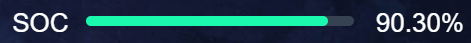

[目录](./)
# percent

类似 elementui 的 progress 的一个仿制。  

此通能已集成至 [modell-vue2-frame](https://tech-demo.waygc.net/vue2-frame/#/?percent)

```
<template>
  <div class="percent-box">
    <div class="percent-name-box">{{ name }}</div>
    <div class="percent-bg-box">
      <div :style="`background-color:${color}`; width: ${value}%;`"></div>
      <div></div>
    </div>
    <div class="percent-val-box">{{ (value).toFixed(2) }}%</div>
  </div>
</template>
<script>
export default {
  props: {
    percent: {
      type: Number,
      default: 0
    },
    name: {
      type: String,
      default: ""
    },
    color: {
      type: String,
      default: "#1af9ad"
    }
  },
  data () {
    return {
      value: 0,
      canFix: true,
    }
  },
  watch: {
    percent: function (v1, v2) {
      this.setValue(v1);
    }
  },
  created () {
    this.setValue(this.percent);
  },
  methods: {
    setValue (value) {
      if (isNaN(value)) {
        this.value = 0;
      } else {
        this.value = value;
      }
    }
  }
}
</script>
<style lang="scss" scoped>
.percent-box {
  width: 100%;
  position: relative;
  margin: 8px 0px;

  >div {
    display: inline-block;
    vertical-align: middle;
    color: #FFFFFF;
    font-size: 26px;
  }

  .percent-name-box {
    width: 74px;
  }

  .percent-bg-box {
    width: calc(100% - 184px);
    border-radius: 10px;
    position: relative;
    >div {
      margin-top: -8px;
      position: absolute;
      border-radius: 10px;
      height: 10px;

      &:first-child {
        z-index: 100;
      }
      &:last-child {
        background: #364151;
        width: 100%;
      }
    }
  }

  .percent-val-box {
    width: 110px;
    text-align: right;
  }
}
</style>
```

调用
```
<percent name="SOC" :percent="value" :color="#CC0000" />
```

## 实际效果
