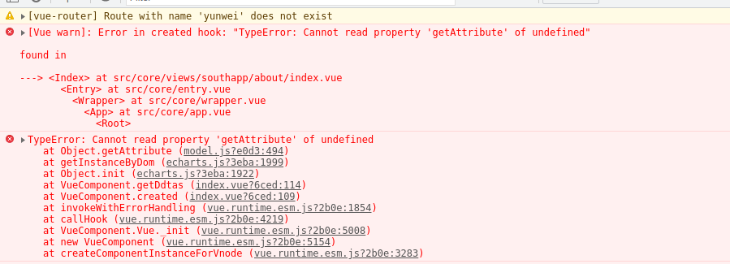

[目录](./)
# vue引用 echarts 出现：TypeError Cannot read property getAttribute of undefined 错误

vue 代码：
```
<template>
    <div ref="messageCvs" style="height:500px;width:100%"></div>
</template>
<script>
    created () {
        this.getDatas()
    }
    methods: () {
        getDatas () {
            const messageCvs = echarts.init(this.$refs.messageCvs, { renderer: 'canvas' })
            // 下略
        }
    }
</script>
```

结果出现以下错误：


网上搜索后，说是dom没有加载完的问题，要放在this.$nextTick改成
```
created() {
    this.$nextTick(() => {
      this.getDatas()
    })
  }
```

然后就可以了。

或者把 `created` 换成 `mounted` 。