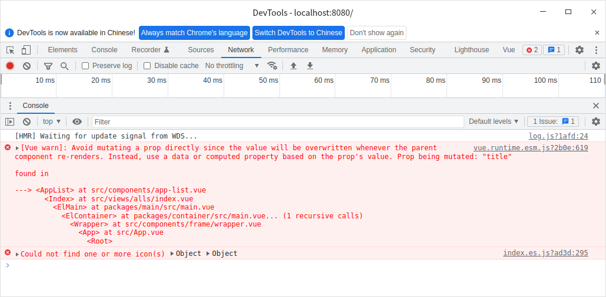

[目录](./)
# 【VUE异常】Avoid mutating a prop directly since the value will be overwritten

# 现象
写 Bug 的时候出现了这么个异常：



对应代码：
```
<template>
	<div :title="title"></div>
</template>
<script>
<script>
export default {
	props: {
		title: {
			type: String,
			default: ""
		}
	}
};
</script>
```

## 原因（官方文档）
> prop 是单向绑定的：当父组件的属性变化时，将传导给子组件，但是不会反过来。这是为了防止子组件无意修改了父组件的状态——这会让应用的数据流难以理解。  
> 虽然废弃了props的双向绑定对于整个项目整体而言是有利且正确的，但是在某些时候我们确实需要从组件内部修改props的需求

## 解决方案

不要直接引用 props 的内容，将其赋值给 data 即可。  
是否有更适合的方式，待研究。

## 参考

* [https://blog.csdn.net/u013948858/article/details/118342541](https://blog.csdn.net/u013948858/article/details/118342541)