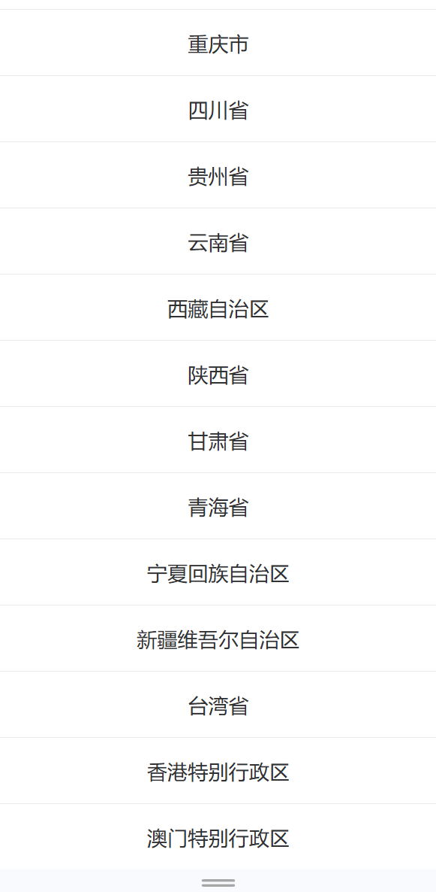
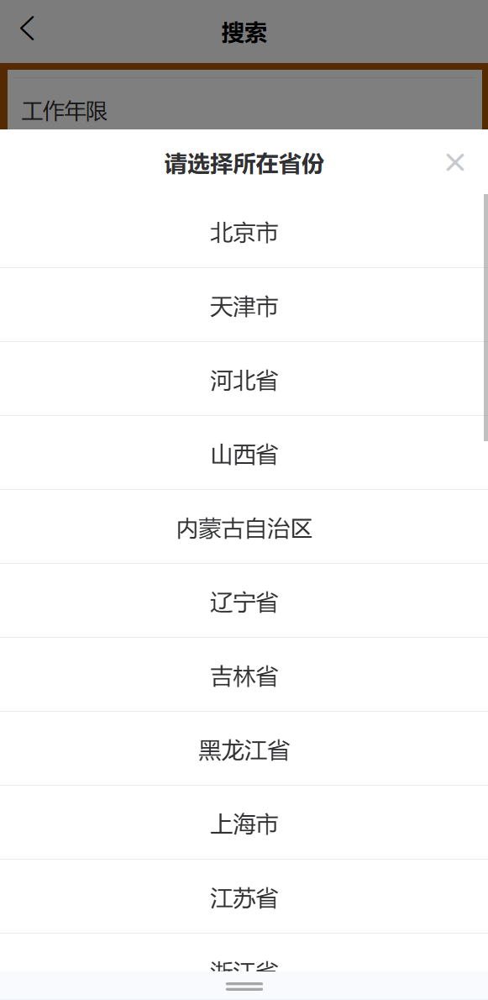

[目录](./)

# action-sheet 数据太多时的坑

给 action-sheet 做数据的时候，如果数据太多，比如要载入全国所有省份

```
<u-action-sheet  @select="(evt) => { onSelectVal('province', evt) }" @close="onCloseActionSheet('province')"
			:actions="provinceItems" title="请选择所在省份" :show="showFlg.province"></u-action-sheet>
```

会遇到类似下面的问题



也就是因为数据太多，而导致 action-sheet 占满了整个界面。  
而且不知道为什么，居然无法滚动！  
无法滚动！  
滚动！


我是真没想到 uviewui 会留这么个问题给使用者，  
官方竟然也没解决……  
所以，只能手动修改代码。

查了一些做法，都是要去修改 uviewui 的源代码，我自身并不想这么做，原因如下：

1. 这样仅对本项目有效，如果换个项目，或者 uview 换个版本立刻就要重新这么来一次；
2. 侵入性太重，修改了这里是否会对其他地方产生影响，我无法把握

基于以上两点，我决定这么做

1. 给`u-action-sheet` 手动加入一个 class

```
<u-action-sheet  @select="(evt) => { onSelectVal('province', evt) }" @close="onCloseActionSheet('province')"
			class="action-sheet-data-over-box"
			:actions="provinceItems" title="请选择所在省份" :show="showFlg.province"></u-action-sheet>
```

2. 基于这个 class ，再去添加样式控制

```
.action-sheet-data-over-box {
	.u-action-sheet__item-wrap {
    overflow: scroll !important;
    max-height: 80vh;
	}
}
```

最终效果：



当然，我这个方法也仅对本项目有效，或者 uviewui 换版本之后是否还继续有效也未调查。  
但好处就是一个 css 命令可以复制到任何新项目中去，马上生效，且侵入性不强。

所以也就先这样吧~