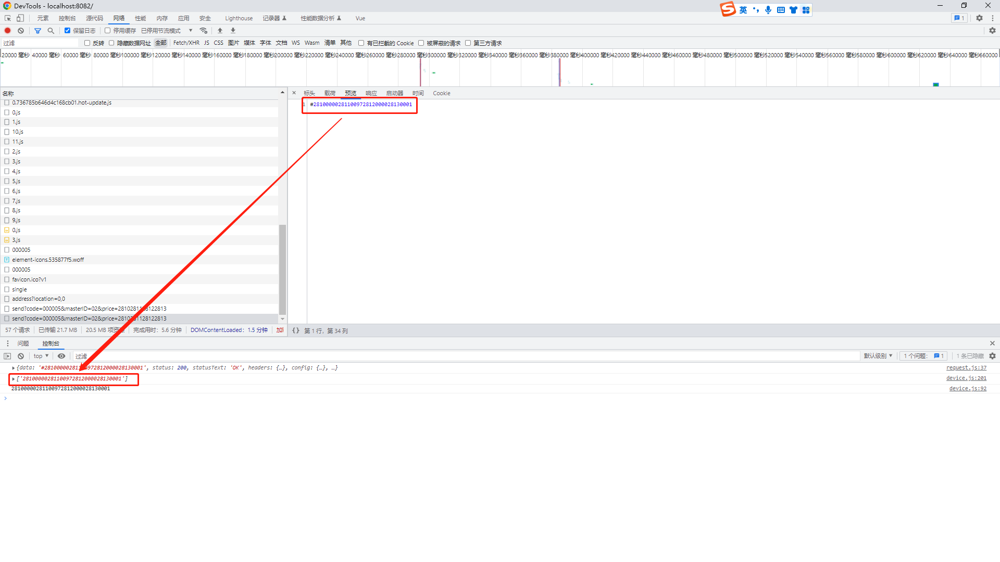

[目录](./)

# 大数字返回值的问题

写Bug 的时候遇到一个问题，因为某些原因，现在的项目需要从需要从硬件设备上读取数据，所以后台返回了从硬件设备中读取的数据，但结果就出现了下面的问题。

因为返回的是纯数字，所以 axios 似乎把这串东西当成一个大数字来处理了。  
尴尬了……

网上看了半天也没有类似的回答，只能自己想办法了。  
不过办法也很简单，既然 axios 认返回值是个数字，那让返回的这串东西不是数字就可以了~  
于是联系后端，让在处理这个信息的时候，在返回值的前面加个 `#` 上去，然后我只要在代码里加个 `slice(1)` 就万事大吉了~

搞定！