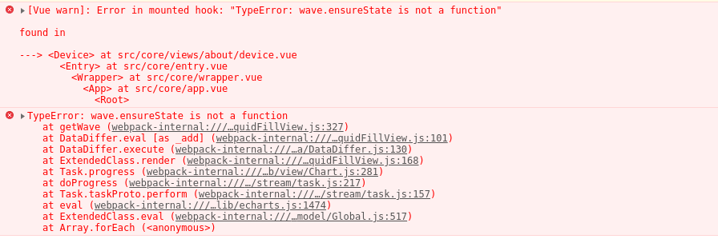

[目录](./)
# 水球图


这种图形叫“水球图”，对应的 echarts 的包叫 `echarts-liquidfill` 。  
但 `echarts-liquidfill` 并不在 `echarts` 包内，需要单独安装。

```
npm install echarts
npm install echarts-liquidfill
```

**而且对版本依赖有要求。**

最新的 `echarts-liquidfill` 版本号是 `3.0.0` 如果使用 5 以下的版本的 `echarts` ，会出现 `wave.ensureState` 错误）。  


其他的版本怎么匹配没研究过。  
看网上的说法，以下版本的配合也是可以的：

> “echarts”: “^4.9.0”,  
> “echarts-liquidfill”: “^2.0.6”

我换到下面这个配合，就没问题了。

> “echarts”: “^5.1.2”,  
> “echarts-liquidfill”: “^3.0.0”