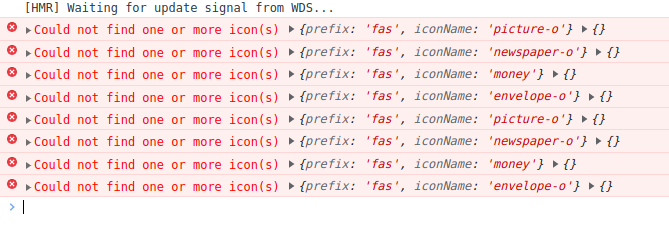

[目录](./)
# fontawesome中文网几个坑爹的图标

用 fontawesome 写图标，有大部分图标都很正常，但有几个图标就是不正常。

开始的时候，还以为自己版本不对或者是什么造成的，于是重新下了最新的包，结构还是不对。  
傻眼了，开始一点点 debug fontawesome 的源代码，看看哪里出问题了。  

好家伙，不 debug 不知道，这一 debug 马上就发现问题出在哪里了！  
放一个对比就很明白了

| 中文网 | 官网 |
| --- | --- |
| [http://www.fontawesome.com.cn/icons/picture-o/](http://www.fontawesome.com.cn/icons/picture-o/)  | [https://fontawesome.com/icons/image](https://fontawesome.com/icons/image) |
| [http://www.fontawesome.com.cn/icons/money/](http://www.fontawesome.com.cn/icons/money/)  | [https://fontawesome.com/icons/money-bill](https://fontawesome.com/icons/money-bill) | 
| [http://www.fontawesome.com.cn/icons/envelope-o/](http://www.fontawesome.com.cn/icons/envelope-o/)   | [https://fontawesome.com/icons/envelope](https://fontawesome.com/icons/envelope) |
| [http://www.fontawesome.com.cn/icons/newspaper-o](http://www.fontawesome.com.cn/icons/newspaper-o/)  | [https://fontawesome.com/icons/newspaper](https://fontawesome.com/icons/newspaper) |

所以照着中文网的名称，能显示出来才真的 有鬼了。