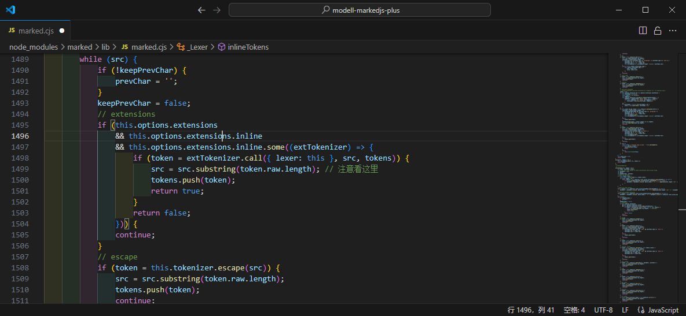

[目录](./)
# 一个似乎是 markedjs 的 bug

最近在给 markedjs 写[扩展](https://gitee.com/undeadway/modell-markedjs-plus)。  
然后写着写着发现了一点不对劲的地方。

在扩展中，我写了这样的代码

```
	const extractsAt = {
		name: "extractsAt",
		level: "inline",
		start: (src) => {
			const match = /@\[image\]\{(\S+?)\}/.exec(src);
			if (match) {
				return match.index;
			} else {
				return -1;
			}
		},
		tokenizer: (src, tokens) => {
			const match = /@\[image\]\{(\S+?)\}/.exec(src);
			if (match) {
				let [ raw, kind, value ] = match;
				const text = raw;
				const index = src.indexOf(raw);
				raw = src.slice(0, index) + raw;

				const token = {
					type: "extractsAt",
					raw, value, text, kind,
					tokens:	lexer.inlineTokens(text)
				}

				return token;
			}
		},
		renderer ({ raw, value, text, kind }) {
			// 略
		}
	}
```

这里的扩展的意思是，我在我的 md 文档中出现 `@[image]{图片编号}` 的时候，可以转换成 `图：图片编号` 这样的输出。  
最终效果也很不错。

但这时，奇怪的问题就来了。

比如，当我的 md 中含有类似下面的代码时

```
第一行

文字@[image]{第一张图} 文字 **输入**的  <!-- 这里的解析成功了 -->
试一试

**第二段**加粗@[image]{第二张图} <!-- 这里的解析失败了 -->

**第二段**加粗

@[image]{第三张图}  
```

输出的效果却没有把 `**第二段**` 给解析出来。  
这让我大感疑惑。

而且如果把加粗放在自定义扩展之后，解析就又是正常的。  
百思不得其解。


debug 之后，发现这似乎是 marked 自身的问题。

我的 marked 是 9.0.1，代码如下图所示。



在  1499 行，src直接 substring 掉了 raw 之前的全部内容。

所以也就造成了 `**第二段**加粗@[image]{第二张图}` 中 `@[image]{第二张图}` 之前的内容全部被舍弃的情况。  
所以才出现了为什么 `**第二段**` 这几个字没有被解析的情况。  
而这个问题，直到 markedjs 最新的 14.1.2 中，依然还存在着。

所以问题就出现了，这究竟是 markedjs 的故意为之呢，还是 bug 呢？  
更或者是我自己代码写错了？