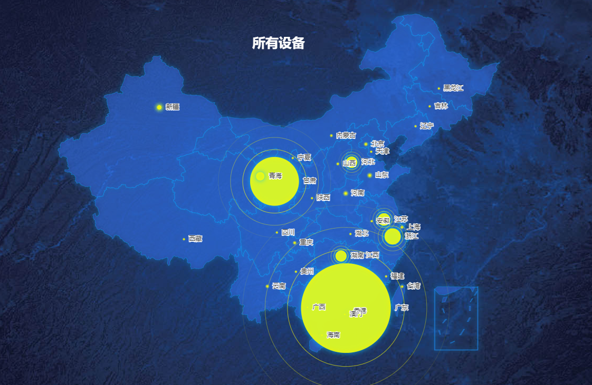
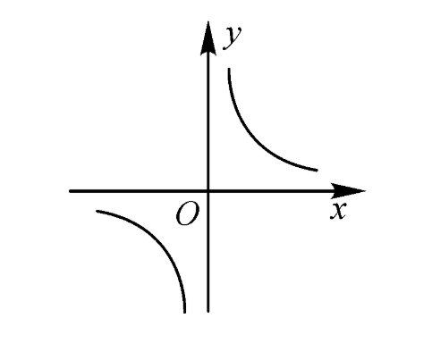
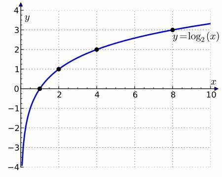
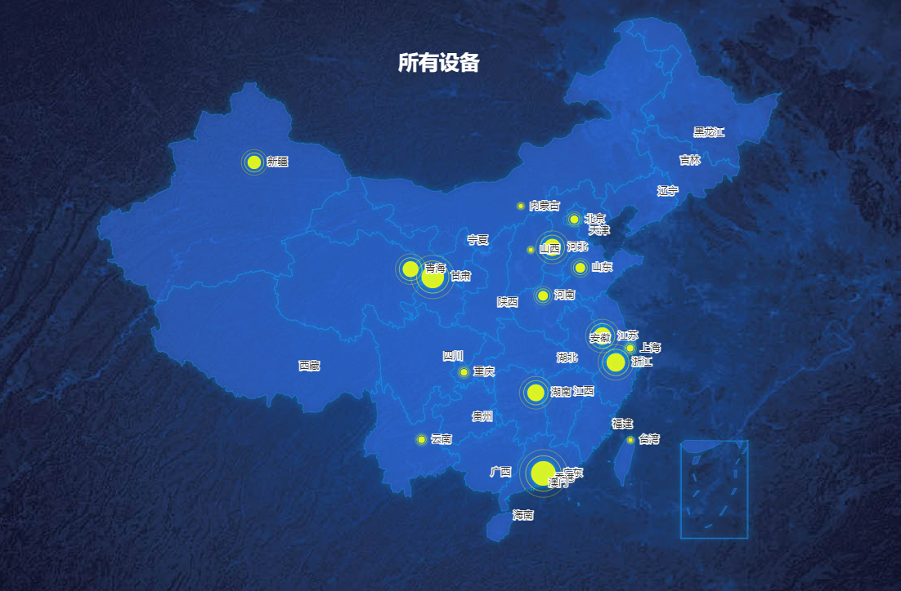

[目录](./)
# 关于对数在前端的一个使用范例

日常写 Bug 的时候，遇到了这么一个需求：

> 需要通过地图，展示公司卖出去的设备。

需求不是什么难事，写地图也不是什么难事。  
上了 eharts 之后，马上完工。

一开始还没有什么问题，但随着测试数据的批量导入之后，发现了一个重大的问题。



如上图所示，如果一个地方的数据太多，显示出来的圈就会越大，甚至会大的过分。  
比如广东和甘肃已经完全把周围的省份给全部包进去了，甚至连点击其他省份都做不到。

所以，这里要改。  

这里的问题是每个省的设备数量关系并不确定。  
一个省可能会有 10000 台设备，而另一个省可能只有 100 台设备。

那 100 倍的差距，换到地图上，就会非常之离谱……  
而且这 100 倍还是半径，换算成面积，那就更加离谱。

所以必须要想个法子压一下数据，最好能控制在 10 倍以内。

首先就是看能不能用两个对象等方式来替换实现。  
最后发现这是 echarts 内部的处理，所以无法实现。

```
  data.map(obj => {
    obj.value = (d[obj.name] || 0);
  });

  const options = {
    title: {
      text: this.mapTitle,
      left: "center",
      top: "15%",
      textStyle: {
        color: "#FFFFFF",
        fontSize: 25,
      },
    },
    tooltip: {
      trigger: 'item',
      formatter: function(params) { // 这里是 echarts 的内部处理，没有 key 等可利用的内容
        let value = params.data.value[2] || params.data.value[2] === 0 ? params.data.value[2] : params.data.value;
        return `${params.data.name}(${value})`;
      }
    },
    series: [{
      name: '散点',
      type: 'scatter',
      coordinateSystem: 'geo',
      data: convertData(data), // data 的数据在这里注入
    }]
  }
```

所以只能通过数学方法来实现上述需求了。

**另外，因为这里用的是同一组数据，所以这个过程还必须是可逆的**

一个几何级数增长的曲线，我首先想到的就是开根号。  
但开根号的问题是，如果有几十上百万的设备的话，就算开根号之后，数据依然很大。  
要不就开三次、四次根，但这样就没完没了了。  
而且一旦半径超过 10 倍，视觉上的差距就更明显。

也想过 `y=1/x` 形式的数据去计算，但却因为数学过程早就忘了，所以也不好取值。  


再然后，思考了很多方法后，在传统艺能蹲坑时灵光一闪——对数！

对数的本质是把记录指数。  
比如

```
y=10^x
```
记录成对数就是
```
x=log(y)
```

然后指数的增长曲线长这样  


也就是说，哪怕数据上真有 1000000（10^6） 这样的数据，通过对数一算，也变成了 6 。  
完美的契合我想把数据压到 10 以内的需求。

一通修改后，最后的代码是

```
  data.map(obj => {
    obj.value = (d[obj.name] || 0);
    obj.value = (obj.value === 0) ? 0 : Math.log10(obj.value); // 取对数
  });

  const options = {
    title: {
      text: this.mapTitle,
      left: "center",
      top: "15%",
      textStyle: {
        color: "#FFFFFF",
        fontSize: 25,
      },
    },
    tooltip: {
      trigger: 'item',
      formatter: function(params) {
        let value = params.data.value[2] || params.data.value[2] === 0 ? params.data.value[2] : params.data.value;
        value = (value === 0) ? 0 : Math.trunc( Math.pow(10, value)); // 通过指数还原
        return `${params.data.name}(${value})`;
      }
    },
    series: [{
      name: '散点',
      type: 'scatter',
      coordinateSystem: 'geo',
      data: convertData(data), // data 的数据在这里注入
    }]
  }
```

另外，在 js 计算的时候 `Math.log10(0)` 会被算成 `-Infinity` ，而 `Math.pow(10, -Infinity)` 也会被算成 `0` 。  
但我不敢保证这是浏览器框架的作用，还是 js 原生支持（没查过手册）  
所以，个人还是把 0 做了特殊处理。

最后呈现的效果如下



最后要说明一下，这里为什么不用 两个对象。  
一开始确实没发现，后来发现了好像确实可以用两个对象来解决……  
但此时代码都已经改完了，所以也懒得再修改。

所以，就这样吧~