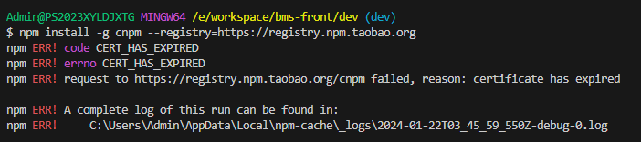

[目录](./)

# certificate has expire

日常写 debug 的时候，突然发生了这么个错误。



查了一下，说是

> 2014年2月27日，npm不再支持自签名证书。因为npm install走的是https协议，需要通过数字证书来保证的。

之类的云云。

但问题是 2014年？都 TM 10年前的问题了，怎么到现在都还有？  
很莫名其妙的一个问题。

然后解决方案是取消 npm 的 ssl 验证。

```
npm config set strict-ssl false
```