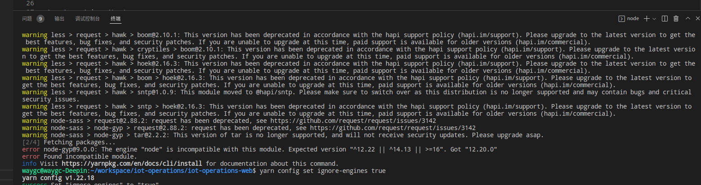

[目录](./)
# yarn 报 Found incompatible module 错误

### 1, 现象



### 2, 错误原因
```
error node-gyp@9.0.0: The engine "node" is incompatible with this module. Expected version "^12.22 || ^14.13 || >=16". Got "12.20.0"
```
看起来是版本不兼容，本地的 node 版本太低造成的

### 3, 解决方案
```
yarn config set ignore-engines true
```
原理待查。
